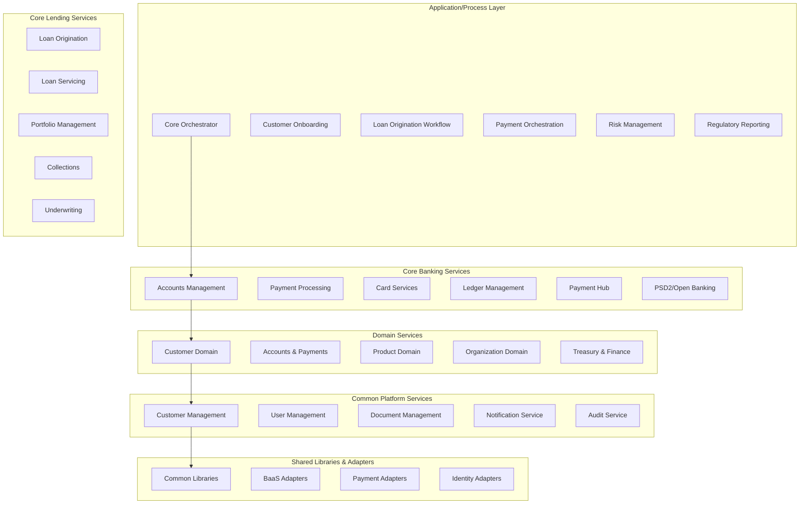

<h1 align="center">Firefly — Open-Core Banking Platform</h1>

  <i>Build banks like software products — modern, modular, and open.</i>

  
  
  
  
  

---

**Firefly** provides fintech teams and banks an **open-core** foundation to launch and scale financial products—without black boxes or vendor lock-in. Built with **composable architecture**, **cloud-native** baseline, and **transparent by design** principles.

**Core capabilities:** Banking accounts, payments hub, lending services, compliance, risk management, document handling, and comprehensive APIs.

---

## 🧱 Design Tenets

- **API-first** — clean, versioned contracts with SDKs.
- **Event-driven** — decoupled domains with streaming/CDC.
- **Security-led** — least privilege, signed artifacts, SBOMs.
- **Testable by default** — golden datasets, simulators, reproducible envs.
- **Observability everywhere** — tracing, metrics, actionable logs.

---

## 🛠️ Tech Stack (typical)

- **Backend:** Java/Spring Boot 3 (WebFlux), Kotlin or Java
- **Data:** PostgreSQL, Kafka (events/streams)
- **Infra:** Docker, Kubernetes, Helm, GitHub Actions
- **Ops UI:** Angular/React (where applicable)

> Stacks may vary by repo—see each README for specifics.

---

## 🏗️ Architecture Documentation

Firefly follows a **microservices architecture** with clear separation of concerns across multiple layers:

### 📚 Detailed Layer Documentation

- **[📋 Complete Architecture Overview](docs/architecture.md)** - Platform architecture vision and design principles
- **[🏛️ Core Banking Services](docs/core-banking-services.md)** - Account management, payments, cards, and ledger services
- **[💰 Core Lending Services](docs/core-lending-services.md)** - Loan origination, servicing, portfolio management, and collections
- **[⚙️ Application Services](docs/application-services.md)** - Workflow orchestration and business process automation
- **[🏢 Domain Services](docs/domain-services.md)** - Specialized business domain services and bounded contexts
- **[🛡️ Common Platform Services](docs/common-platform-services.md)** - Shared platform capabilities and cross-cutting concerns
- **[📚 Shared Libraries & Adapters](docs/shared-libraries-adapters.md)** - Reusable components and external system integrations
- **[🏗️ Infrastructure Layer](docs/infrastructure-layer.md)** - Cloud infrastructure, containerization, and operational components

---

## 🚀 Get Started

1. **Explore the repos** → domain services, SDKs, and adapters.
2. **Read the architecture docs** → understand the platform structure and components.
3. **Read each README** → local setup, environment variables, samples.
4. **Run locally** → most services ship `docker-compose` or Helm charts.
5. **Extend** → add adapters (KYC, payments, FX, core hooks).
6. **Contribute** → pick a **Good First Issue** or open a **Discussion**.

---

## 🤝 Contributing

We welcome issues, PRs, and RFCs. Great first contributions include:
- improving quickstarts or docs,
- adding tests or examples for a public API,
- proposing rule/policy examples for the Policy Engine.

Before contributing:
- Review **CONTRIBUTING.md** and **CODE_OF_CONDUCT.md**.
- For security issues, follow **SECURITY.md**.

---

## 🧩 Use Cases You Can Build

- **Neobank / EMI** — multi-currency accounts, cards, payments, fees.
- **Lending / BNPL** — pricing, eligibility, disbursements, collections.
- **Wallets & Programs** — stored value, limits, KYX, compliance workflows.
- **Treasury & FX** — internal ledgering, settlements, reconciliation.

---

## 📍 Quick Links

- 🌐 **Website:** https://getfirefly.io  
- 📚 **Docs:** (coming soon)  
- 🗺️ **Roadmap / Milestones:** (coming soon)
- 🛡️ **Security Policy:** see `SECURITY.md`  
- 💬 **Community:** GitHub Discussions (and chat, if available)

---

## 🏁 Why Firefly

- **Modern core, zero lock-in.**  
- **Composable domains** that evolve with your roadmap.  
- **Production-ready patterns** for compliance, scale, and speed.

> Ship value faster. Don’t reinvent the core.

---

  Made with ❤️ by the <b>Firefly</b> community. 
  © 2025 Firefly Software Solutions Inc. Some repositories may offer enterprise add-ons; see individual licenses.

