  
  

<h1 align="center">🔥 Firefly — OpenCore Banking Platform</h1>

  <i>Modern, modular, and open — build banks, not monoliths.</i>

  
  
  
  
  

---

## 🌟 Mission

**Firefly** is an **open-core banking platform** for teams who want the control, transparency, and speed of open source—without compromising on security, compliance, or scale.

- **Transparent by design:** audit everything, extend anything.
- **Composable architecture:** pick the domains you need; evolve without rewrites.
- **Cloud-native foundations:** built for scale, reliability, and automation.

---

## 🧭 What’s inside (at a glance)

- **Core Banking Domains:** accounts, customers, products, pricing, fees, limits.
- **Ledger & Accounting:** double-entry, postings, reconciliation, audit trails.
- **Payments Hub:** orchestration, rails connectors, settlements, FX hooks.
- **Risk & Compliance:** KYC/KYB providers, AML checks, screening, rule engine.
- **Policy/Rule Engine:** configurable decisions for pricing, eligibility, and flows.
- **Data & Telemetry:** events, CDC, analytics feeds, observability.
- **Integration Layer:** APIs/SDKs, webhooks, jobs, adapters to external systems.

> 🧩 **Open Core:** Community-first with optional enterprise add-ons and tooling.

---

## 🏗️ Architecture (Mermaid)

```mermaid
flowchart LR
%% Client Layer
    subgraph CLIENT [" 🌐 Client Channels "]
        direction LR
        A["📱 Mobile/Web<br/>Frontend Apps"]:::ui
        B["🔧 Ops Console<br/>Admin Interface"]:::ui
        C["🔗 Partners/APIs<br/>External Integration"]:::ui
    end

%% Edge Layer
    subgraph EDGE [" 🛡️ Edge & Security "]
        direction TB
        G["🚪 API Gateway<br/>• JWT Verification<br/>• Rate Limiting<br/>• Request Routing"]:::gateway
        IAM["🔐 Identity & Access<br/>• OIDC/SAML Auth<br/>• RBAC Permissions<br/>• Security Audit"]:::security
    end

%% Core Business Layer
subgraph BUSINESS [" ⚙️ Core Business Services "]
direction TB

subgraph ROW1 [" "]
SVC["🏢 Domain Services<br/>• Account Management<br/>• Customer Data<br/>• Product Catalog<br/>• Pricing Engine"]:::core
LEDGER["📊 Financial Ledger<br/>• Transaction Postings<br/>• Journal Entries<br/>• Reconciliation"]:::core
end

subgraph ROW2 [" "]
PAY["💳 Payment Hub<br/>• Payment Rails<br/>• Transaction Orchestration<br/>• Settlement Processing"]:::core
RISK["⚖️ Risk & Compliance<br/>• KYC/KYB Verification<br/>• AML Monitoring<br/>• Risk Screening"]:::core
end

subgraph ROW3 [" "]
RULES["📋 Policy Engine<br/>• Business Rules DSL<br/>• Decision Management<br/>• Rule Evaluation"]:::core
INT["🔄 Integration Hub<br/>• Webhook Management<br/>• External Adapters<br/>• Async Job Processing"]:::core
end
end

%% Platform Layer
subgraph PLATFORM [" 🏗️ Platform & Operations "]
direction LR
DATA["📈 Data Platform<br/>• Event Streaming<br/>• Change Data Capture<br/>• Analytics & BI<br/>• System Observability"]:::platform
OPS["🛠️ Platform Operations<br/>• CI/CD Pipeline<br/>• Infrastructure as Code<br/>• SRE Monitoring<br/>• Performance Tuning"]:::platform
end

%% Connections - Client to Edge
A --> G
B --> G
C --> G

%% Edge Internal
G --> IAM
IAM --> G

%% Edge to Business
G --> SVC
G --> PAY

%% Business Service Interconnections
SVC --> LEDGER
SVC --> PAY
SVC --> RISK
PAY --> LEDGER
RISK --> RULES
RULES --> SVC
INT --> SVC
INT --> PAY
INT --> RISK

%% Business to Platform
SVC --> DATA
LEDGER --> DATA
PAY --> DATA
RISK --> DATA
RULES --> DATA
INT --> DATA

%% Platform Internal
DATA -.->|"📊 metrics & logs"| OPS
G -.->|"🔍 traces & telemetry"| OPS
OPS -.->|"🔄 deployment & scaling"| BUSINESS

%% Enhanced Styling
classDef ui fill:#f8fafc,stroke:#3b82f6,stroke-width:3px,color:#1e40af,font-weight:bold;
classDef gateway fill:#fef3c7,stroke:#f59e0b,stroke-width:3px,color:#92400e,font-weight:bold;
classDef security fill:#fee2e2,stroke:#ef4444,stroke-width:3px,color:#b91c1c,font-weight:bold;
classDef core fill:#ecfdf5,stroke:#10b981,stroke-width:2px,color:#047857,font-weight:bold;
classDef platform fill:#f3e8ff,stroke:#8b5cf6,stroke-width:3px,color:#6b21a8,font-weight:bold;

%% Subgraph Styling
classDef subgraphStyle fill:#f9fafb,stroke:#6b7280,stroke-width:2px,color:#374151;
```

---

## 🧱 Principles

- **API-first** — clean, well-typed contracts and SDKs.
- **Event-driven** — decouple domains; embrace streaming and CDC.
- **Security-led** — least privilege, signed artifacts, SBOMs.
- **Testable by default** — golden testdata, simulators, reproducible envs.
- **Observability everywhere** — tracing, metrics, and actionable logs.

---

## 🚀 Get started

1. **Explore the repos** → browse domain services, SDKs, and adapters.
2. **Read the READMEs** → each repo includes setup and local dev guides.
3. **Run locally** → most services provide docker-compose or Helm charts.
4. **Extend** → implement adapters (KYC, payments, FX, core-bank hooks).
5. **Contribute** → see `CONTRIBUTING.md` in each repo.

> Need a hand? Open a **Discussion** or start with a **Good First Issue**.

---

## 🧩 Tech stack (typical)

- **Backend:** Java / Spring Boot 3 (WebFlux), Kotlin or Java
- **Data:** PostgreSQL, Kafka (events/streams)
- **Infra:** Docker, Kubernetes, Helm, GitHub Actions
- **Frontend (ops):** Angular/React (where applicable)

*(Stacks may vary by repo; check each README for specifics.)*

---

## 🤝 Contributing

We welcome issues, PRs, and RFCs. A great first PR could be:
- fixing a doc, improving a quickstart, or adding a small adapter.
- adding tests or examples for a public API.
- proposing a policy/rule example for the Rule Engine.

Before you contribute:
- Read the repo’s **CONTRIBUTING.md** and **CODE_OF_CONDUCT.md**.
- For security issues, please follow the **SECURITY.md** policy.

---

## 📍 Quick links

- 🌐 **Website:** https://getfirefly.io
- 📚 **Docs:** (coming soon)
- 🗺️ **Roadmap / Milestones:** see GitHub Projects
- 🛡️ **Security Policy:** see `SECURITY.md` in each repo
- 💬 **Community:** Discussions (and chat, if available)

---

## 🏁 Why Firefly

- **Modern core** without lock-in.
- **Composable** domains that grow with you.
- **Battle-ready** patterns for compliance, scale, and speed.

> If you’re building financial products, you should be shipping value—not reinventing the core.

---

  Made with ❤️ by the <b>firefly-oss</b> community. 
  © Firefly. Some repositories may offer enterprise add-ons; see individual licenses.

