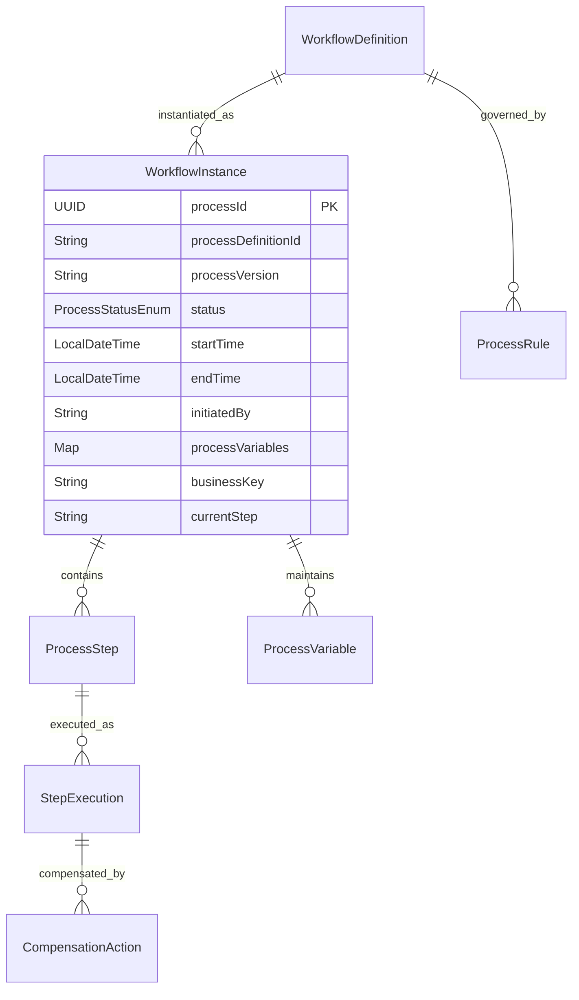
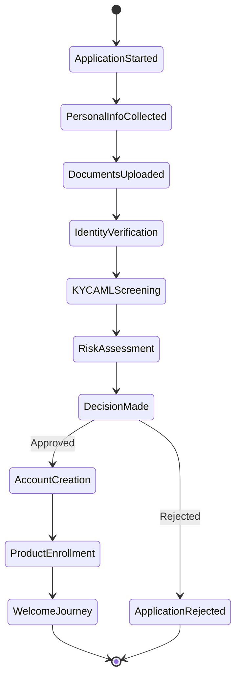
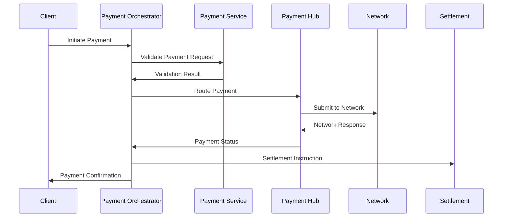
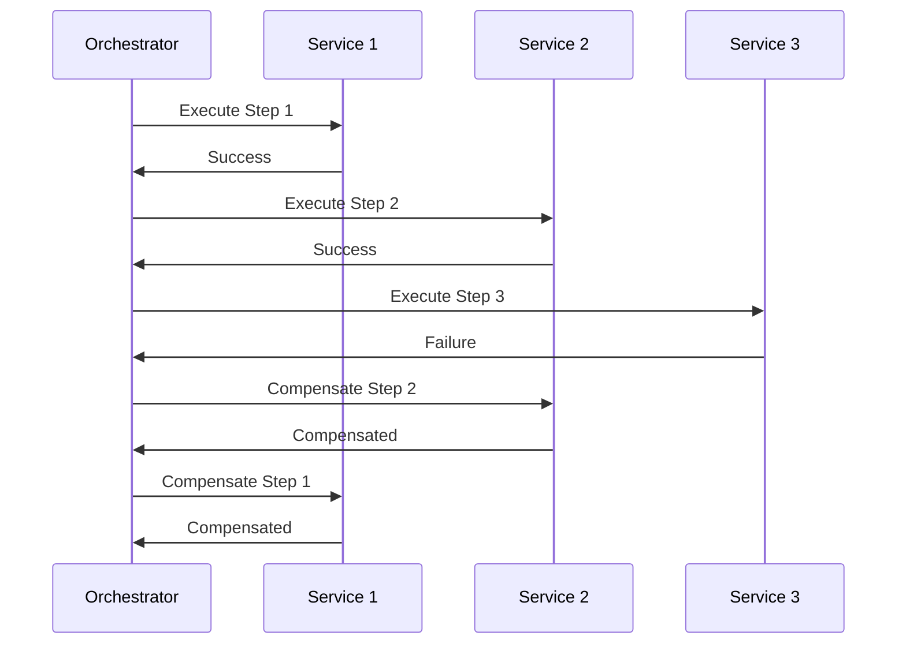
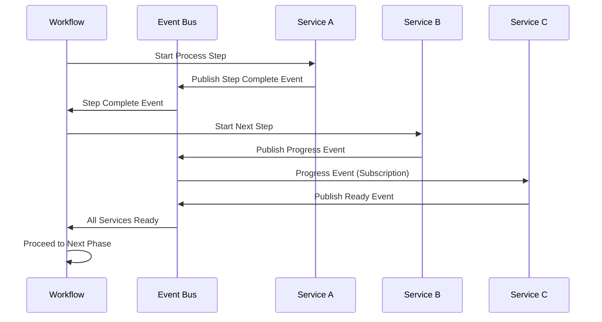
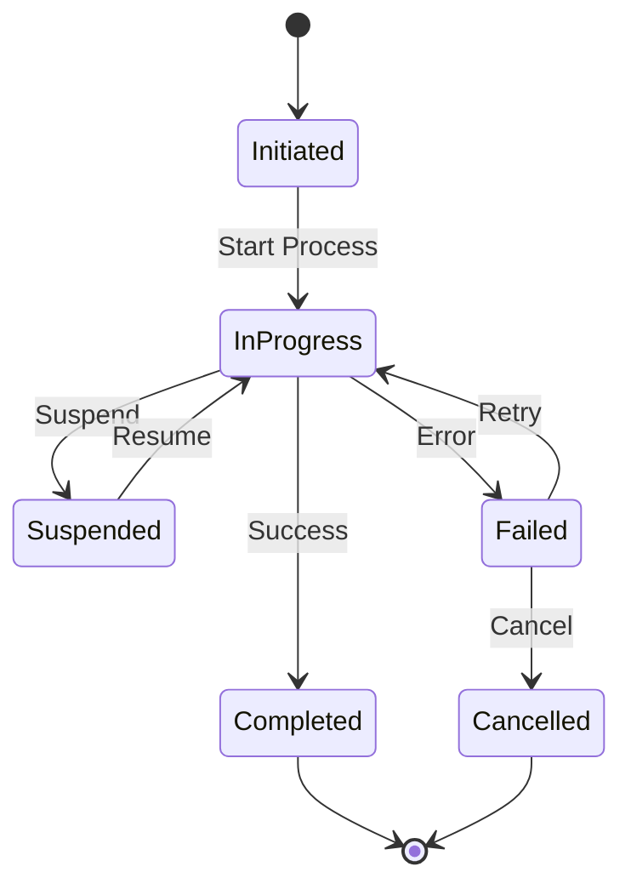

# Application Services Layer - Deep Dive

## Overview

The Application Services Layer provides orchestration, workflow management, and business process automation across the Firefly OpenCore Banking Platform. This layer coordinates complex multi-service interactions, manages long-running business processes, and provides integration capabilities with external systems.

## Service Architecture

### Service Characteristics
- **Orchestration-Focused**: Coordinates multiple domain services to fulfill business processes
- **Stateful Workflows**: Maintains process state across long-running transactions
- **Event-Driven**: Responds to and publishes business events for process coordination
- **Integration-Heavy**: Manages interactions with external systems and partners
- **Business Process Management**: Implements configurable workflow definitions
- **Compensating Actions**: Handles rollback and error recovery scenarios

### Module Structure Pattern
```
application-service/
├── application-service-interfaces/  # Process DTOs, workflow contracts
├── application-service-models/      # Process entities, state management
├── application-service-core/        # Workflow engines, orchestration logic
├── application-service-web/         # Process APIs, monitoring endpoints
├── application-service-sdk/         # Client libraries for process interaction
└── pom.xml                         # Maven configuration
```

## Core Application Services

Based on the actual codebase analysis, here are the confirmed application services:

### 1. core-orchestrator

**Purpose**: Workflow orchestration service built with Spring Boot and Camunda 8 (Zeebe) for managing customer-related business processes.

#### Key Capabilities
- **Workflow Definition**: BPMN 2.0 compliant workflow modeling
- **Process Orchestration**: Multi-service transaction coordination
- **State Management**: Persistent workflow state tracking
- **Compensation Handling**: Automatic rollback and error recovery
- **Event Correlation**: Business event matching and routing
- **Process Monitoring**: Real-time workflow visibility and analytics
- **Dynamic Routing**: Conditional process flow based on business rules
- **External System Integration**: Third-party service coordination

#### Workflow Examples
- **Customer Onboarding**: End-to-end customer acquisition process
- **Loan Origination**: Multi-step loan application and approval workflow
- **Account Opening**: Comprehensive account setup and activation
- **Payment Processing**: Multi-rail payment orchestration
- **Fraud Investigation**: Suspicious activity investigation workflows
- **Regulatory Reporting**: Automated compliance report generation

#### Data Model Highlights


#### API Endpoints
- `POST /api/v1/processes/start` - Start workflow instance
- `GET /api/v1/processes/{processId}` - Process status and details
- `POST /api/v1/processes/{processId}/signal` - Send signal to process
- `PUT /api/v1/processes/{processId}/variables` - Update process variables
- `POST /api/v1/processes/{processId}/complete-step` - Complete process step
- `GET /api/v1/process-definitions` - Available workflow definitions
- `POST /api/v1/processes/{processId}/cancel` - Cancel process instance

#### Integration Points
- **All Domain Services**: Service orchestration and coordination
- **Event Bus**: Process event publishing and consumption
- **External APIs**: Third-party system integration
- **Notification Service**: Process status notifications
- **Audit Service**: Process execution auditing
- **Configuration Service**: Business rule evaluation

### 2. app-customer-onboarding

**Purpose**: Specialized application service for customer acquisition and digital onboarding workflows.

#### Key Capabilities
- **Multi-Channel Onboarding**: Web, mobile, branch, and partner channels
- **Identity Verification**: Automated KYC/AML processing
- **Document Collection**: Digital document upload and processing
- **Decision Automation**: Risk-based customer acceptance decisions
- **Account Setup**: Automatic account creation and configuration
- **Product Enrollment**: Cross-sell and up-sell product recommendations
- **Compliance Screening**: Regulatory compliance verification
- **Welcome Journey**: Post-onboarding customer engagement

#### Process Flow


#### API Endpoints
- `POST /api/v1/onboarding/applications` - Start onboarding application
- `PUT /api/v1/onboarding/{applicationId}/personal-info` - Submit personal information
- `POST /api/v1/onboarding/{applicationId}/documents` - Upload documents
- `POST /api/v1/onboarding/{applicationId}/verify-identity` - Trigger identity verification
- `GET /api/v1/onboarding/{applicationId}/status` - Application status
- `POST /api/v1/onboarding/{applicationId}/decision` - Submit manual decision
- `GET /api/v1/onboarding/{applicationId}/offers` - Product recommendations

#### Integration Points
- **Customer Management**: Customer profile creation
- **Document Management**: Document storage and verification
- **KYC Services**: Identity verification and compliance
- **Account Services**: Account creation and setup
- **Product Services**: Product recommendation and enrollment
- **Risk Services**: Risk assessment and decisioning
- **Notification Service**: Application status updates

### 3. app-loan-origination-workflow

**Purpose**: Comprehensive loan origination process management from application through funding.

#### Key Capabilities
- **Application Processing**: Multi-product loan application handling
- **Underwriting Workflow**: Automated and manual underwriting processes
- **Document Management**: Loan documentation collection and review
- **Approval Workflow**: Multi-level approval routing and decisions
- **Funding Coordination**: Loan closing and disbursement orchestration
- **Exception Handling**: Loan application exception processing
- **Compliance Integration**: Regulatory compliance workflow steps
- **Performance Tracking**: Origination metrics and SLA monitoring

#### Process Stages
1. **Pre-Qualification**: Initial borrower screening
2. **Application**: Complete loan application submission
3. **Underwriting**: Credit analysis and risk assessment
4. **Approval**: Decision making and approval workflow
5. **Documentation**: Loan documentation generation
6. **Closing**: Final review and loan execution
7. **Funding**: Loan disbursement and account setup

#### API Endpoints
- `POST /api/v1/loan-origination/applications` - Submit loan application
- `GET /api/v1/loan-origination/{applicationId}/status` - Application status
- `POST /api/v1/loan-origination/{applicationId}/underwrite` - Submit for underwriting
- `PUT /api/v1/loan-origination/{applicationId}/decision` - Record approval decision
- `POST /api/v1/loan-origination/{applicationId}/documents/generate` - Generate loan docs
- `POST /api/v1/loan-origination/{applicationId}/fund` - Fund approved loan
- `GET /api/v1/loan-origination/pipeline` - Origination pipeline view

#### Integration Points
- **Lending Services**: Loan application and servicing setup
- **Underwriting Service**: Credit decision processing
- **Document Service**: Loan documentation management
- **Customer Service**: Borrower information and communication
- **Funding Service**: Loan disbursement coordination
- **Compliance Service**: Regulatory requirement verification
- **Pricing Service**: Loan rate and term determination

### 4. app-payment-orchestration

**Purpose**: Multi-rail payment processing orchestration and exception handling.

#### Key Capabilities
- **Payment Routing**: Intelligent payment rail selection
- **Multi-Hop Payments**: Complex payment routing scenarios
- **Exception Processing**: Failed payment handling and recovery
- **Settlement Coordination**: Payment settlement orchestration
- **Reconciliation Support**: Payment matching and reconciliation
- **Fraud Prevention**: Real-time fraud screening integration
- **Regulatory Compliance**: Payment regulation compliance
- **Performance Optimization**: Payment cost and speed optimization

#### Payment Processing Flow


#### API Endpoints
- `POST /api/v1/payment-orchestration/payments` - Orchestrate payment
- `GET /api/v1/payment-orchestration/{paymentId}/status` - Payment status
- `POST /api/v1/payment-orchestration/{paymentId}/retry` - Retry failed payment
- `POST /api/v1/payment-orchestration/bulk` - Bulk payment processing
- `GET /api/v1/payment-orchestration/exceptions` - Payment exceptions
- `POST /api/v1/payment-orchestration/{paymentId}/cancel` - Cancel payment
- `GET /api/v1/payment-orchestration/performance` - Performance metrics

#### Integration Points
- **Payment Services**: Core payment processing
- **Payment Hub**: Payment routing and switching
- **Account Services**: Account balance management
- **Fraud Services**: Real-time fraud detection
- **Settlement Services**: Payment settlement coordination
- **Notification Service**: Payment status notifications
- **Reconciliation Service**: Payment matching and reconciliation

### 5. app-regulatory-reporting

**Purpose**: Automated regulatory reporting workflow management and compliance orchestration.

#### Key Capabilities
- **Report Generation**: Automated regulatory report creation
- **Data Aggregation**: Multi-source data collection and consolidation
- **Validation Engine**: Data quality and compliance validation
- **Submission Workflow**: Regulatory agency submission processes
- **Exception Handling**: Data quality issue resolution
- **Audit Trail**: Complete regulatory reporting audit trail
- **Schedule Management**: Regulatory reporting calendar management
- **Version Control**: Report version management and tracking

#### Supported Reports
- **Call Reports**: Quarterly financial condition reports
- **BSA/AML Reports**: Anti-money laundering compliance reporting
- **HMDA Reports**: Home mortgage disclosure act reporting
- **CRA Reports**: Community Reinvestment Act reporting
- **CECL Reports**: Current expected credit loss reporting
- **Stress Testing**: Supervisory stress testing reports
- **Capital Reports**: Regulatory capital calculations

#### API Endpoints
- `POST /api/v1/regulatory-reporting/reports/generate` - Generate regulatory report
- `GET /api/v1/regulatory-reporting/reports/{reportId}/status` - Report generation status
- `POST /api/v1/regulatory-reporting/reports/{reportId}/validate` - Validate report data
- `POST /api/v1/regulatory-reporting/reports/{reportId}/submit` - Submit to regulator
- `GET /api/v1/regulatory-reporting/schedule` - Reporting calendar
- `GET /api/v1/regulatory-reporting/exceptions` - Data quality exceptions
- `POST /api/v1/regulatory-reporting/reports/{reportId}/approve` - Approve report

#### Integration Points
- **All Core Services**: Regulatory data collection
- **Data Lake**: Regulatory data warehouse
- **Document Service**: Report storage and management
- **Audit Service**: Regulatory audit trail
- **Notification Service**: Reporting status notifications
- **External Systems**: Regulatory agency interfaces
- **Compliance Service**: Regulatory requirement management

### 6. app-risk-management-workflow

**Purpose**: Comprehensive risk management process orchestration and monitoring.

#### Key Capabilities
- **Risk Assessment**: Automated risk scoring and evaluation
- **Limit Management**: Credit and operational limit monitoring
- **Stress Testing**: Economic scenario stress testing workflows
- **Model Management**: Risk model deployment and monitoring
- **Exception Processing**: Risk threshold breach handling
- **Portfolio Analysis**: Risk concentration analysis
- **Early Warning**: Risk deterioration detection and alerting
- **Regulatory Capital**: Risk-weighted asset calculation workflows

#### Risk Workflow Types
- **Credit Risk**: Loan portfolio risk assessment
- **Market Risk**: Interest rate and market risk evaluation
- **Operational Risk**: Operational event risk management
- **Liquidity Risk**: Cash flow and liquidity monitoring
- **Concentration Risk**: Portfolio concentration analysis
- **Model Risk**: Risk model validation and monitoring

#### API Endpoints
- `POST /api/v1/risk-management/assessments` - Initiate risk assessment
- `GET /api/v1/risk-management/portfolio/metrics` - Portfolio risk metrics
- `POST /api/v1/risk-management/stress-tests` - Run stress test scenarios
- `GET /api/v1/risk-management/limits/violations` - Risk limit violations
- `POST /api/v1/risk-management/models/deploy` - Deploy risk model
- `GET /api/v1/risk-management/early-warning` - Early warning indicators
- `POST /api/v1/risk-management/reports/generate` - Generate risk reports

#### Integration Points
- **Risk Services**: Risk calculation engines
- **Portfolio Management**: Portfolio data and analytics
- **Model Hub**: Risk model management
- **Data Lake**: Risk data warehouse
- **Compliance Service**: Risk regulatory requirements
- **Notification Service**: Risk alert management
- **External Data**: Market data and economic indicators

## Service Interaction Patterns

### Saga Pattern Implementation


### Event-Driven Workflow Coordination


## Workflow Patterns

### State Machine Pattern


### Circuit Breaker Pattern
- **Closed State**: Normal operation with service calls
- **Open State**: Fast-fail mode when service is unavailable
- **Half-Open State**: Limited calls to test service recovery

### Retry and Backoff Strategies
- **Exponential Backoff**: Increasing delay between retry attempts
- **Linear Backoff**: Fixed delay between retries
- **Circuit Breaking**: Stop retries when failure threshold reached
- **Dead Letter Queues**: Failed message handling and analysis

## Performance & Scalability

### Performance Targets
- **Workflow Initiation**: < 500ms to start process
- **Step Execution**: < 2s per workflow step
- **Compensation**: < 10s for rollback operations
- **Process Visibility**: < 1s for status queries

### Scalability Strategies
- **Horizontal Process Distribution**: Workflow instances across nodes
- **Event Sourcing**: Append-only workflow state storage
- **Process State Partitioning**: Distribute workflow state by business key
- **Asynchronous Processing**: Non-blocking workflow execution
- **Compensation Queue**: Separate compensation processing

### Monitoring & Observability

#### Process Metrics
- **Process Throughput**: Workflows completed per time period
- **Process Duration**: End-to-end process execution time
- **Step Success Rate**: Individual step completion rates
- **Compensation Rate**: Frequency of rollback operations
- **Error Distribution**: Error patterns and root causes

#### Business Metrics
- **Customer Onboarding Rate**: Successful customer acquisitions
- **Loan Approval Rate**: Loan origination success metrics
- **Payment Success Rate**: Payment processing reliability
- **Regulatory Compliance**: Reporting accuracy and timeliness

## Error Handling & Recovery

### Error Classification
- **Transient Errors**: Temporary service unavailability
- **Business Errors**: Business rule violations
- **System Errors**: Infrastructure and technical failures
- **Data Errors**: Data quality and validation issues

### Recovery Strategies
- **Automatic Retry**: Retry with exponential backoff
- **Manual Intervention**: Human review and decision
- **Compensation**: Rollback completed steps
- **Dead Letter Processing**: Failed message analysis
- **Circuit Breaking**: Prevent cascade failures

### Compensation Actions
- **Account Reversal**: Undo account balance changes
- **Document Deletion**: Remove uploaded documents
- **Status Rollback**: Revert entity status changes
- **Notification Cancellation**: Cancel pending notifications
- **External System Rollback**: Coordinate external reversals

## Security & Compliance

### Process Security
- **Workflow Authorization**: Role-based process access control
- **Step-Level Security**: Fine-grained permission checking
- **Data Encryption**: Sensitive process data protection
- **Audit Logging**: Complete process execution audit trail
- **PII Protection**: Personal data handling in workflows

### Compliance Integration
- **Regulatory Workflow Steps**: Built-in compliance checkpoints
- **Audit Trail**: Regulatory audit requirement satisfaction
- **Data Retention**: Process data lifecycle management
- **Regulatory Reporting**: Automated compliance reporting
- **Exception Handling**: Regulatory exception processing

This Application Services Layer provides the orchestration and coordination capabilities necessary to implement complex banking business processes while maintaining reliability, scalability, and regulatory compliance.
