# Firefly OpenCore Banking Platform - Architecture Overview

## Table of Contents
- [Architecture Vision](#architecture-vision)
- [Layered Architecture](#layered-architecture)
- [Domain Architecture](#domain-architecture)
- [Technology Stack](#technology-stack)
- [Design Principles](#design-principles)
- [Communication Patterns](#communication-patterns)
- [Deployment Architecture](#deployment-architecture)

## Architecture Vision

Firefly OpenCore Banking Platform is designed as a **cloud-native, event-driven, domain-centric banking platform** that enables financial institutions to build, deploy, and scale banking services rapidly while maintaining compliance, security, and operational excellence.

### Core Architectural Principles
- **Domain-Driven Design (DDD)** - Clear business domain boundaries and ubiquitous language
- **Event-Driven Architecture (EDA)** - Loosely coupled services with event-based communication
- **Reactive Programming** - Non-blocking, resilient, and scalable service interactions
- **API-First** - Comprehensive APIs with auto-generated SDKs and documentation
- **Cloud-Native** - Built for containerization, orchestration, and cloud deployment

## Layered Architecture

```mermaid
graph TB
    subgraph "Application/Process Layer"
        direction TB
        APP1[core-orchestrator<br/>Process Orchestration]
        APP2[administration-backoffice<br/>Admin Operations]
        APP3[operations-backoffice<br/>Operations Management]
    end
    
    subgraph "Application Services Layer"
        direction LR
        AS1[bfc-customers<br/>Customer Apps]
        AS2[bfc-onboarding<br/>Onboarding Apps]
        AS3[bfc-lending-simulator<br/>Lending Simulation]
        AS4[bfc-initconfig<br/>Initialization Config]
        AS5[*-app-*<br/>Business Applications]
    end
    
    subgraph "Core Banking Services"
        direction LR
        CBS1[core-banking-accounts<br/>Account Management]
        CBS2[core-banking-cards<br/>Card Services]
        CBS3[core-banking-payments<br/>Payment Processing]
        CBS4[core-banking-ledger<br/>General Ledger]
        CBS5[core-banking-payment-hub<br/>Payment Hub]
        CBS6[core-banking-psdx<br/>PSD2 Compliance]
        CBS7[core-banking-card-transaction-authorization-center<br/>Card Authorization]
    end
    
    subgraph "Core Lending Services"
        direction LR
        CLS1[core-lending-loan-origination<br/>Loan Origination]
        CLS2[core-lending-leasing<br/>Leasing Services]
        CLS3[core-lending-mortgage<br/>Mortgage Services]
        CLS4[core-lending-credit-scoring<br/>Credit Assessment]
        CLS5[core-lending-credit-cards<br/>Credit Cards]
        CLS6[core-lending-collateral-management<br/>Collateral Management]
        CLS7[+ 7 more lending services]
    end
    
    subgraph "Domain Services Layer"
        direction TB
        subgraph "Customer Domain"
            CD1[customer-domain-people<br/>People Management]
            CD2[customer-domain-kyc-kyb<br/>KYC/KYB Processes]
            CD3[customer-domain-aml-ctf<br/>AML/CTF Compliance]
            CD4[customer-domain-consents<br/>Consent Management]
            CD5[customer-domain-contracts<br/>Contract Management]
            CD6[customer-domain-cases-complaints<br/>Case Management]
            CD7[customer-domain-docs-attachments<br/>Document Management]
            CD8[customer-domain-ubo-registry<br/>UBO Registry]
        end
        
        subgraph "Accounts & Payments Domain"
            APD1[accounts-payments-domain-initiation<br/>Payment Initiation]
            APD2[accounts-payments-domain-ledger<br/>Payment Ledger]
            APD3[accounts-payments-domain-clearing-switch<br/>Clearing & Settlement]
            APD4[accounts-payments-domain-charges<br/>Fees & Charges]
            APD5[accounts-payments-domain-tokens<br/>Tokenization]
            APD6[accounts-payments-domain-issuing-cards<br/>Card Issuing]
            APD7[accounts-payments-domain-remittance-payouts<br/>Remittances]
            APD8[accounts-payments-domain-standing-orders<br/>Standing Orders]
            APD9[accounts-payments-domain-gateways<br/>Payment Gateways]
            APD10[accounts-payments-domain-transactions-engine<br/>Transaction Engine]
        end
        
        subgraph "Organization Domain"
            OD1[organization-domain-branches<br/>Branch Management]
            OD2[organization-domain-channels<br/>Channel Management]
            OD3[organization-domain-employees<br/>Employee Management]
            OD4[organization-domain-positions<br/>Position Management]
            OD5[organization-domain-roles<br/>Role Management]
        end
        
        subgraph "Product Domain"
            PD1[product-domain-accounts-deposits<br/>Deposit Products]
            PD2[product-domain-cards<br/>Card Products]
            PD3[product-domain-lending<br/>Lending Products]
            PD4[product-domain-pricing<br/>Pricing Engine]
            PD5[product-domain-product-catalog<br/>Product Catalog]
            PD6[product-domain-trade-finance<br/>Trade Finance Products]
        end
        
        subgraph "Distributor Domain"
            DD1[distributor-domain-agents<br/>Agent Management]
            DD2[distributor-domain-branding<br/>Brand Management]
            DD3[distributor-domain-catalog<br/>Distributor Catalog]
            DD4[distributor-domain-partner-settlement<br/>Partner Settlement]
            DD5[distributor-domain-pipeline<br/>Sales Pipeline]
        end
        
        subgraph "Treasury & Finance Domain"
            TFD1[treasury-finance-domain-alm-ftp<br/>Asset Liability Management]
            TFD2[treasury-finance-domain-fx-rates-services<br/>FX Rates]
            TFD3[treasury-finance-domain-gl-bi-bridge<br/>GL-BI Bridge]
            TFD4[treasury-finance-domain-kpi-financials<br/>Financial KPIs]
            TFD5[treasury-finance-domain-liquidity-cash-mgmt<br/>Liquidity Management]
            TFD6[treasury-finance-domain-revenue-accounting<br/>Revenue Accounting]
            TFD7[treasury-finance-domain-risk-forecasting<br/>Risk Forecasting]
            TFD8[treasury-finance-domain-securities-stp<br/>Securities STP]
        end
        
        subgraph "Reporting Data Domain"
            RDD1[reporting-data-domain-api-surface<br/>Reporting APIs]
            RDD2[reporting-data-domain-audit-trail-observability<br/>Audit & Observability]
            RDD3[reporting-data-domain-common-model<br/>Common Data Model]
            RDD4[reporting-data-domain-telemetry<br/>Telemetry Services]
        end
    end
    
    subgraph "Common Platform Services"
        direction LR
        CPS1[common-platform-customer-mgmt<br/>Customer Management]
        CPS2[common-platform-user-mgmt<br/>User Management]
        CPS3[common-platform-org-mgmt<br/>Organization Management]
        CPS4[common-platform-product-mgmt<br/>Product Management]
        CPS5[common-platform-config-mgmt<br/>Configuration Management]
        CPS6[common-platform-contract-mgmt<br/>Contract Management]
        CPS7[common-platform-document-mgmt<br/>Document Management]
        CPS8[common-platform-notification-services<br/>Notification Services]
        CPS9[common-platform-auth-mgmt<br/>Authentication Management]
        CPS10[common-platform-kycb-mgmt<br/>KYC/KYB Management]
        CPS11[common-platform-sca-mgmt<br/>SCA Management]
        CPS12[common-platform-distributor-mgmt<br/>Distributor Management]
        CPS13[common-platform-accounting-gl<br/>General Ledger]
        CPS14[common-platform-modelhub<br/>Dynamic Data Modeling]
        CPS15[common-platform-reference-master-data<br/>Master Data]
        CPS16[common-platform-rule-engine<br/>Business Rules]
        CPS17[common-platform-callbacks-mgmt<br/>Callback Management]
        CPS18[common-platform-webhooks-mgmt<br/>Webhook Management]
    end
    
    subgraph "Shared Libraries & Adapters"
        direction LR
        subgraph "Core Libraries"
            LIB1[lib-parent-pom<br/>Maven Parent]
            LIB2[lib-common-core<br/>Core Utilities]
            LIB3[lib-common-domain<br/>Domain Modeling]
            LIB4[lib-common-web<br/>Web Utilities]
            LIB5[lib-common-r2dbc<br/>Reactive Data Access]
            LIB6[lib-common-auth<br/>Authentication]
            LIB7[lib-utils<br/>General Utilities]
            LIB8[lib-commons-validators<br/>Validation]
            LIB9[lib-common-vaadin<br/>Vaadin UI]
            LIB10[lib-common-application<br/>Application Framework]
        end
        
        subgraph "Integration Adapters"
            ADAPT1[lib-baas-adapter<br/>BaaS Adapter Interface]
            ADAPT2[lib-baas-treezor-impl<br/>Treezor Implementation]
            ADAPT3[lib-idp-adapter<br/>IDP Adapter Interface]
            ADAPT4[lib-idp-keycloak-impl<br/>Keycloak Implementation]
            ADAPT5[lib-sdk-treezor<br/>Treezor SDK]
        end
        
        subgraph "Platform Libraries"
            PLAT1[lib-transactional-engine<br/>Transaction Engine]
            PLAT2[lib-plugin-manager<br/>Plugin Management]
        end
    end
    
    subgraph "Infrastructure Layer"
        direction LR
        INF1[(PostgreSQL<br/>Primary Database)]
        INF2[(Apache Kafka<br/>Event Streaming)]
        INF3[(Redis<br/>Caching & Sessions)]
        INF4[Docker<br/>Containerization]
        INF5[Kubernetes<br/>Orchestration]
        INF6[Istio<br/>Service Mesh]
    end
    
    APP1 --> CBS1
    APP1 --> CLS1
    AS1 --> CBS1
    CBS1 --> CPS1
    CLS1 --> CPS1
    CPS1 --> LIB2
    LIB5 --> INF1
    PLAT1 --> INF2
```

## Domain Architecture

### 1. Application/Process Layer
**Purpose**: High-level business process orchestration and user-facing applications

#### Process Orchestration
- `core-orchestrator` - Business process workflow engine and orchestration

#### Administrative Applications
- `administration-backoffice` - System administration and configuration
- `operations-backoffice` - Operational management and monitoring

### 2. Application Services Layer
**Purpose**: Business application services and customer-facing applications

#### Banking for Companies (BFC) Services
- `bfc-customers` - Corporate customer management applications
- `bfc-onboarding` - Customer onboarding workflows
- `bfc-lending-simulator` - Lending simulation and calculation tools
- `bfc-initconfig` - System initialization and configuration services

#### Business Application Services
- Onboarding Applications: `onboarding-accounts-app-*`
- Payment Applications: `payments-app-*`
- Lending Applications: `lending-app-*`
- Distributor Applications: `distributors-app-*`
- Risk & Compliance Applications: `risk-compliance-treasury-app-*`
- Trade Finance Applications: `trade-finance-app-*`
- Data Reporting Applications: `data-reporting-shared-app-*`

### 3. Core Banking Services
**Purpose**: Fundamental banking operations and services

- `core-banking-accounts` - Account lifecycle management and operations
- `core-banking-cards` - Card issuance, management, and lifecycle
- `core-banking-payments` - Payment processing and orchestration
- `core-banking-ledger` - Double-entry bookkeeping and general ledger
- `core-banking-payment-hub` - Payment routing, clearing, and settlement
- `core-banking-psdx` - PSD2 compliance and Open Banking APIs
- `core-banking-card-transaction-authorization-center` - Real-time card authorization

### 4. Core Lending Services
**Purpose**: Credit and lending business capabilities

- `core-lending-loan-origination` - Loan application and approval processes
- `core-lending-leasing` - Equipment and asset leasing services
- `core-lending-mortgage` - Mortgage lending and servicing
- `core-lending-credit-scoring` - Credit risk assessment and scoring
- `core-lending-credit-cards` - Credit card product management
- `core-lending-collateral-management` - Collateral tracking and valuation
- `core-lending-delinquency-collections` - Collections and recovery
- `core-lending-factoring` - Invoice factoring services
- `core-lending-confirming` - Trade finance confirming
- `core-lending-renting` - Rental and subscription services
- `core-lending-loan-servicing` - Loan administration and servicing
- `core-lending-provisioning-risk` - Risk provisioning and IFRS 9
- `core-lending-regulatory-compliance` - Lending compliance and reporting

### 5. Domain Services Layer
**Purpose**: Domain-specific business logic and rules

#### Customer Domain
- `customer-domain-people` - Individual customer management
- `customer-domain-kyc-kyb` - Know Your Customer/Business processes
- `customer-domain-aml-ctf` - Anti-Money Laundering and Counter-Terrorism Financing
- `customer-domain-consents` - Customer consent management (GDPR)
- `customer-domain-contracts` - Customer contract lifecycle
- `customer-domain-cases-complaints` - Case and complaint management
- `customer-domain-docs-attachments` - Document and attachment handling
- `customer-domain-ubo-registry` - Ultimate Beneficial Owner registry

#### Accounts & Payments Domain
- `accounts-payments-domain-initiation` - Payment initiation services
- `accounts-payments-domain-ledger` - Payment-specific ledger operations
- `accounts-payments-domain-clearing-switch` - Payment clearing and switching
- `accounts-payments-domain-charges` - Fee and charge calculation
- `accounts-payments-domain-tokens` - Payment tokenization services
- `accounts-payments-domain-issuing-cards` - Card issuing domain logic
- `accounts-payments-domain-remittance-payouts` - Remittance and payout services
- `accounts-payments-domain-standing-orders` - Standing order management
- `accounts-payments-domain-gateways` - Payment gateway integration
- `accounts-payments-domain-transactions-engine` - Transaction processing engine

#### Organization Domain
- `organization-domain-branches` - Branch and location management
- `organization-domain-channels` - Channel management (digital, physical)
- `organization-domain-employees` - Employee lifecycle management
- `organization-domain-positions` - Position and hierarchy management
- `organization-domain-roles` - Role-based access control

#### Product Domain
- `product-domain-accounts-deposits` - Deposit account products
- `product-domain-cards` - Card product definitions
- `product-domain-lending` - Lending product catalog
- `product-domain-pricing` - Dynamic pricing engine
- `product-domain-product-catalog` - Product catalog management
- `product-domain-trade-finance` - Trade finance products

#### Distributor Domain
- `distributor-domain-agents` - Agent and broker management
- `distributor-domain-branding` - White-label branding services
- `distributor-domain-catalog` - Distributor-specific product catalogs
- `distributor-domain-partner-settlement` - Partner revenue settlement
- `distributor-domain-pipeline` - Sales pipeline management

#### Treasury & Finance Domain
- `treasury-finance-domain-alm-ftp` - Asset Liability Management and Funds Transfer Pricing
- `treasury-finance-domain-fx-rates-services` - Foreign exchange rate services
- `treasury-finance-domain-gl-bi-bridge` - General Ledger to Business Intelligence bridge
- `treasury-finance-domain-kpi-financials` - Financial KPI calculation
- `treasury-finance-domain-liquidity-cash-mgmt` - Liquidity and cash management
- `treasury-finance-domain-revenue-accounting` - Revenue recognition and accounting
- `treasury-finance-domain-risk-forecasting` - Risk modeling and forecasting
- `treasury-finance-domain-securities-stp` - Securities straight-through processing

#### Reporting Data Domain
- `reporting-data-domain-api-surface` - Reporting API abstraction layer
- `reporting-data-domain-audit-trail-observability` - Audit trails and observability
- `reporting-data-domain-common-model` - Common data models for reporting
- `reporting-data-domain-telemetry` - Telemetry and metrics collection

### 6. Common Platform Services
**Purpose**: Shared business services and platform capabilities

#### Identity & Access Management
- `common-platform-user-mgmt` - User lifecycle and authentication
- `common-platform-auth-mgmt` - Authentication service orchestration
- `common-platform-sca-mgmt` - Strong Customer Authentication (SCA)

#### Customer & Organization Management
- `common-platform-customer-mgmt` - Customer data management
- `common-platform-org-mgmt` - Organizational structure management
- `common-platform-kycb-mgmt` - KYC/KYB workflow orchestration
- `common-platform-distributor-mgmt` - Channel and distributor management

#### Product & Contract Management
- `common-platform-product-mgmt` - Product lifecycle management
- `common-platform-contract-mgmt` - Contract templates and lifecycle

#### Document & Communication
- `common-platform-document-mgmt` - Enterprise content management
- `common-platform-notification-services` - Multi-channel notifications
- `common-platform-callbacks-mgmt` - Callback orchestration
- `common-platform-webhooks-mgmt` - Webhook management

#### Configuration & Data Management
- `common-platform-config-mgmt` - System configuration management
- `common-platform-reference-master-data` - Master data management
- `common-platform-modelhub` - Dynamic data modeling platform
- `common-platform-rule-engine` - Business rules and decision engine

#### Financial & Accounting
- `common-platform-accounting-gl` - General ledger and financial accounting

### 7. Shared Libraries & Adapters
**Purpose**: Reusable components, utilities, and external integrations

#### Core Libraries
- `lib-parent-pom` - Maven parent POM with shared configurations
- `lib-common-core` - Core utilities and common patterns
- `lib-common-domain` - Domain modeling utilities and DDD support
- `lib-common-web` - Web layer utilities and configurations
- `lib-common-r2dbc` - Reactive database access with advanced filtering
- `lib-common-auth` - Authentication and authorization framework
- `lib-utils` - General-purpose utilities and helpers
- `lib-commons-validators` - Data validation utilities
- `lib-common-vaadin` - Vaadin UI framework utilities
- `lib-common-application` - Application framework utilities

#### Integration Adapters
- `lib-baas-adapter` - Banking-as-a-Service provider interface
- `lib-baas-treezor-impl` - Treezor BaaS implementation
- `lib-idp-adapter` - Identity Provider adapter interface
- `lib-idp-keycloak-impl` - Keycloak identity provider implementation
- `lib-sdk-treezor` - Treezor SDK wrapper and utilities

#### Platform Libraries
- `lib-transactional-engine` - Transaction processing engine
- `lib-plugin-manager` - Plugin architecture and lifecycle management

## Technology Stack

### Core Technologies
| Component | Technology | Version | Purpose |
|-----------|------------|---------|---------|
| **Runtime** | Java | 21 LTS | Application runtime with Virtual Threads |
| **Framework** | Spring Boot | 3.2.2 | Application framework and dependency injection |
| **Reactive** | Spring WebFlux | 6.1.x | Reactive web framework |
| **Data Access** | Spring Data R2DBC | 3.2.x | Reactive database connectivity |
| **Database** | PostgreSQL | 14+ | Primary relational database |
| **Caching** | Redis | 7+ | Distributed caching and session storage |
| **Messaging** | Apache Kafka | 3.5+ | Event streaming and message broker |
| **Migration** | Flyway | 9.22+ | Database schema migration |

### Development & Build
| Component | Technology | Version | Purpose |
|-----------|------------|---------|---------|
| **Build Tool** | Maven | 3.8+ | Build automation and dependency management |
| **Code Generation** | OpenAPI Generator | 7.2+ | SDK and API client generation |
| **Documentation** | SpringDoc OpenAPI | 2.3+ | API documentation generation |
| **Testing** | JUnit 5 | 5.10+ | Unit and integration testing |
| **Test Containers** | TestContainers | 1.19+ | Integration testing with real dependencies |
| **Object Mapping** | MapStruct | 1.5+ | DTO to Entity mapping |
| **Code Reduction** | Lombok | 1.18+ | Boilerplate code reduction |

### Infrastructure & Deployment
| Component | Technology | Version | Purpose |
|-----------|------------|---------|---------|
| **Containerization** | Docker | 24+ | Application containerization |
| **Orchestration** | Kubernetes | 1.28+ | Container orchestration |
| **Service Mesh** | Istio | 1.19+ | Service-to-service communication |
| **Package Management** | Helm | 3.12+ | Kubernetes package management |
| **Monitoring** | Prometheus | 2.45+ | Metrics collection |
| **Observability** | Grafana | 10+ | Metrics visualization |
| **Logging** | ELK Stack | 8.x | Centralized logging |
| **Tracing** | Jaeger | 1.47+ | Distributed tracing |

## Design Principles

### 1. Domain-Driven Design (DDD)
- **Bounded Contexts**: Clear domain boundaries with explicit interfaces
- **Ubiquitous Language**: Consistent terminology across business and technical teams
- **Aggregate Design**: Proper aggregate boundaries for data consistency
- **Domain Events**: Business events for loose coupling

### 2. Event-Driven Architecture (EDA)
- **Event Sourcing**: Complete audit trail through immutable events
- **CQRS**: Separate read and write models for optimal performance
- **Event Choreography**: Decentralized event-driven workflows
- **Event Storming**: Collaborative domain modeling approach

### 3. Reactive Programming
- **Non-blocking I/O**: Efficient resource utilization
- **Backpressure Handling**: Graceful handling of load variations
- **Resilience Patterns**: Circuit breaker, retry, and timeout patterns
- **Reactive Streams**: Project Reactor for stream processing

### 4. API-First Design
- **OpenAPI Specification**: Contract-first API development
- **SDK Generation**: Auto-generated client libraries
- **Versioning Strategy**: Semantic versioning with backward compatibility
- **Documentation**: Comprehensive API documentation

### 5. Security by Design
- **Zero Trust Architecture**: Never trust, always verify
- **Defense in Depth**: Multiple layers of security controls
- **Least Privilege**: Minimal required access rights
- **Data Protection**: Encryption at rest and in transit

### 6. Cloud-Native Principles
- **12-Factor App**: Cloud-native application methodology
- **Microservices**: Independently deployable services
- **Container-First**: Docker and Kubernetes native
- **Infrastructure as Code**: Declarative infrastructure management

## Communication Patterns

### Synchronous Communication
- **HTTP/REST APIs**: Request-response patterns with OpenAPI documentation
- **Client SDKs**: Auto-generated from OpenAPI specifications
- **Service Mesh**: Istio for secure service-to-service communication
- **Circuit Breaker**: Resilience patterns for external calls

### Asynchronous Communication
- **Apache Kafka**: Event streaming platform for real-time data
- **CloudEvents**: Standardized event format and metadata
- **Event Sourcing**: Immutable event log for audit and replay
- **Saga Pattern**: Distributed transaction coordination

### Data Management
- **Database per Service**: Service autonomy and independent scaling
- **CQRS**: Command Query Responsibility Segregation
- **Event Store**: Persistent event log for event sourcing
- **Read Models**: Optimized projections for query scenarios

## Deployment Architecture

### Container Strategy
- **Multi-stage Builds**: Optimized Docker images with minimal attack surface
- **Distroless Images**: Google's distroless base images for security
- **Health Checks**: Kubernetes liveness and readiness probes
- **Resource Limits**: CPU and memory limits for predictable performance

### Service Mesh Architecture
- **Istio**: Service mesh for secure, observable service communication
- **mTLS**: Automatic mutual TLS for service-to-service encryption
- **Traffic Management**: Load balancing, routing, and circuit breaking
- **Observability**: Distributed tracing and metrics collection

### Deployment Strategies
- **GitOps**: Git-based deployment workflows with ArgoCD
- **Blue-Green Deployment**: Zero-downtime deployments
- **Canary Releases**: Gradual rollout with traffic splitting
- **Feature Flags**: Runtime feature toggles for safe releases

### Scalability & Performance
- **Horizontal Pod Autoscaling**: Automatic scaling based on metrics
- **Vertical Pod Autoscaling**: Right-sizing of resource requests
- **Cluster Autoscaling**: Dynamic cluster node management
- **Connection Pooling**: Optimized database connection management

This architecture provides a solid foundation for building a comprehensive, scalable, and maintainable banking platform that can adapt to changing business requirements while maintaining security, compliance, and operational excellence.
