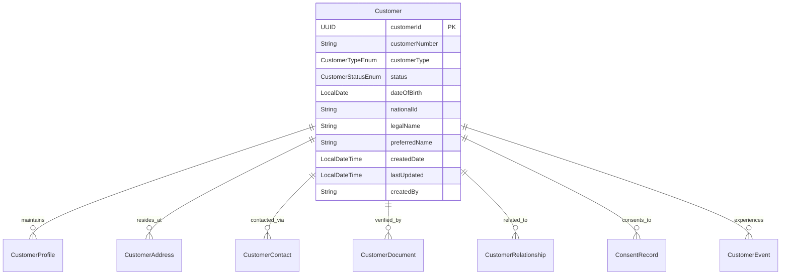
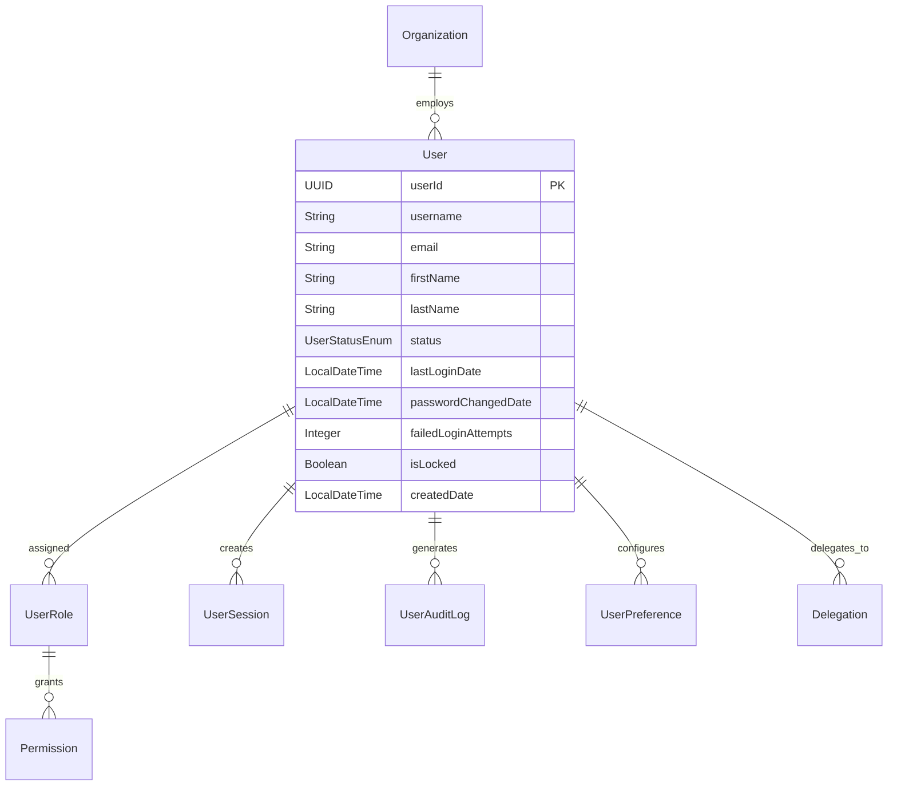
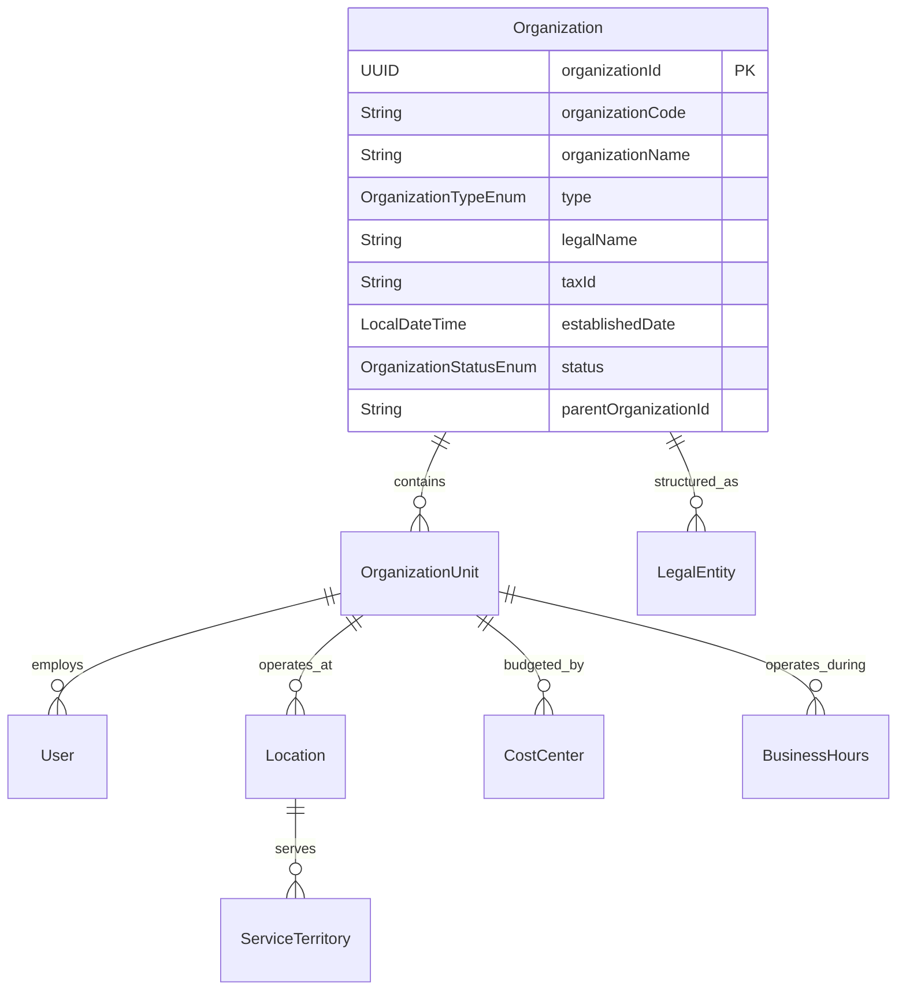
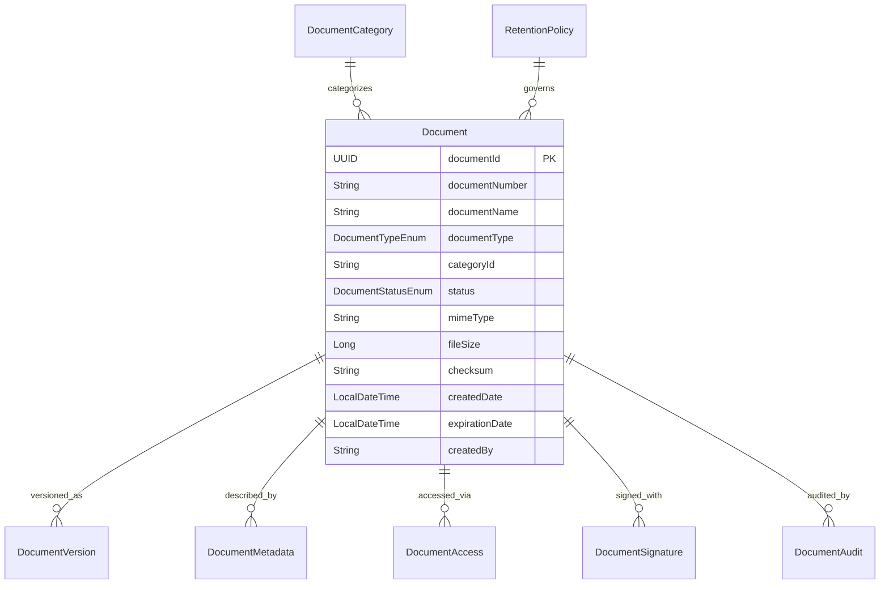
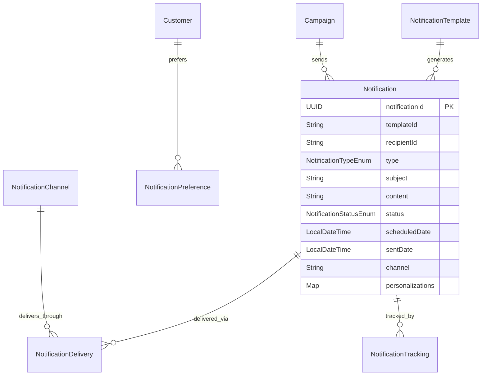
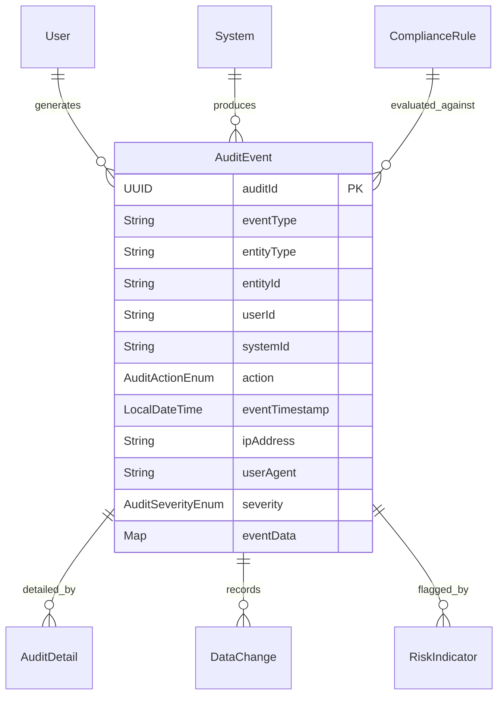
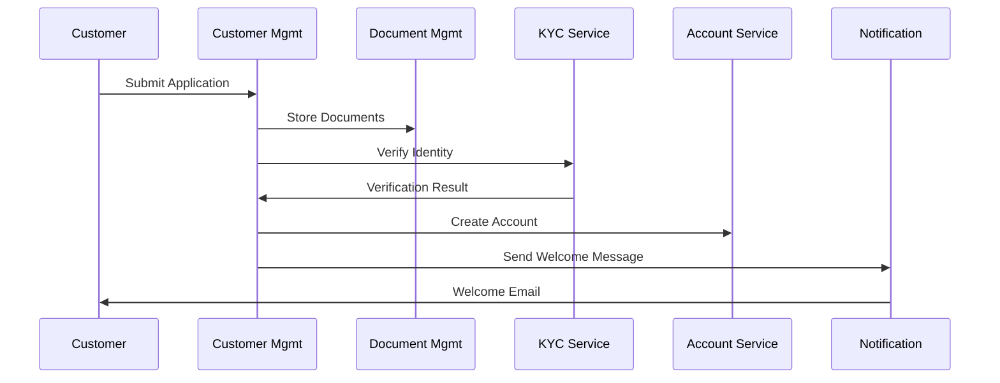
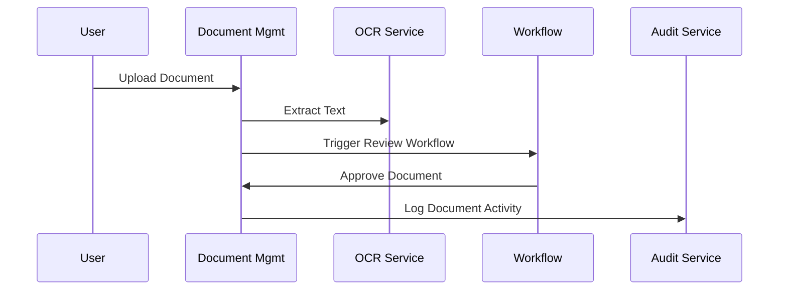
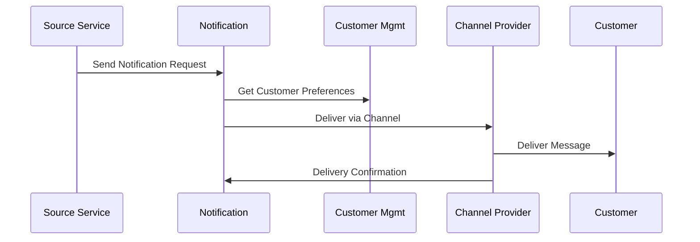

# Common Platform Services Layer - Deep Dive

## Overview

The Common Platform Services Layer provides essential shared capabilities that support all banking operations across the Firefly OpenCore Banking Platform. These services provide foundational functionality including customer management, user administration, document handling, notifications, security, and cross-cutting operational concerns.

## Service Architecture

### Service Characteristics
- **Multi-Tenant**: Support for multiple organizations and business units
- **Event-Driven**: Publishes domain events for cross-service integration
- **API-First**: Comprehensive REST APIs with OpenAPI specifications
- **Security-Centric**: Built-in authentication, authorization, and audit capabilities
- **Cloud-Native**: Horizontally scalable, containerized services
- **Configuration-Driven**: Runtime configuration for business rules and policies

### Module Structure Pattern
```
common-platform-service/
├── common-platform-service-interfaces/  # DTOs, events, API contracts
├── common-platform-service-models/      # Domain entities, repositories
├── common-platform-service-core/        # Business logic, domain services
├── common-platform-service-web/         # REST controllers, security config
├── common-platform-service-sdk/         # Auto-generated client libraries
└── pom.xml                              # Maven configuration
```

## Core Platform Services

Based on the actual codebase analysis, here are the confirmed common platform services:

### 1. common-platform-customer-mgmt

**Purpose**: Comprehensive customer lifecycle management from onboarding through ongoing relationship maintenance.

#### Key Capabilities
- **Customer Onboarding**: Digital customer acquisition workflows
- **Identity Verification**: KYC/AML compliance and identity proofing
- **Profile Management**: Customer demographic and preference data
- **Relationship Mapping**: Customer-to-account and service relationships
- **Lifecycle Events**: Customer status changes and milestone tracking
- **Data Privacy**: GDPR/CCPA compliance and consent management
- **Customer Segmentation**: Classification for marketing and service delivery
- **Cross-Border Support**: Multi-jurisdiction customer management

#### Data Model Highlights


#### API Endpoints
- `POST /api/v1/customers` - Create new customer
- `GET /api/v1/customers/{customerId}` - Retrieve customer details
- `PUT /api/v1/customers/{customerId}/profile` - Update customer profile
- `POST /api/v1/customers/{customerId}/verification` - Submit identity verification
- `GET /api/v1/customers/{customerId}/relationships` - Customer relationships
- `POST /api/v1/customers/{customerId}/consent` - Record consent
- `GET /api/v1/customers/search` - Customer search and filtering

#### Integration Points
- **Account Services**: Customer-account linkage
- **Loan Services**: Borrower information
- **Card Services**: Cardholder management
- **KYC Services**: Identity verification workflows
- **Document Service**: Customer documentation
- **Notification Service**: Customer communications
- **Analytics Service**: Customer behavior analysis

### 2. common-platform-user-management

**Purpose**: Internal user administration, access control, and workforce management for banking operations.

#### Key Capabilities
- **User Lifecycle**: Employee onboarding, role changes, termination
- **Role-Based Access Control**: Hierarchical permission management
- **Multi-Factor Authentication**: Enhanced security for sensitive operations
- **Session Management**: Secure session handling and timeout policies
- **Audit Logging**: Complete user activity tracking
- **Delegation Management**: Temporary access delegation
- **Password Policies**: Configurable password strength and rotation
- **Integration Directory**: LDAP/Active Directory synchronization

#### Data Model Highlights


#### API Endpoints
- `POST /api/v1/users` - Create user account
- `GET /api/v1/users/{userId}` - User details and permissions
- `PUT /api/v1/users/{userId}/roles` - Assign/revoke roles
- `POST /api/v1/users/{userId}/unlock` - Unlock user account
- `GET /api/v1/users/{userId}/audit` - User activity audit trail
- `POST /api/v1/auth/login` - User authentication
- `POST /api/v1/auth/logout` - Session termination
- `GET /api/v1/permissions` - Available permissions and roles

#### Integration Points
- **Authentication Service**: Single sign-on integration
- **Authorization Service**: Permission evaluation
- **Audit Service**: Activity logging
- **Notification Service**: User alerts and notifications
- **Organization Service**: Organizational hierarchy
- **External Directory**: LDAP/AD integration
- **Compliance Service**: Access review and attestation

### 3. common-platform-organization-management

**Purpose**: Organizational structure, hierarchy, and business unit management across the banking enterprise.

#### Key Capabilities
- **Organizational Hierarchy**: Multi-level organizational structures
- **Business Unit Management**: Cost centers, profit centers, divisions
- **Location Management**: Branch, office, and facility information
- **Cost Center Allocation**: Financial reporting and budgeting support
- **Regulatory Entity Management**: Legal entity structures and compliance
- **Service Territory**: Geographic service area definitions
- **Operational Hours**: Business hours and holiday schedules
- **Contact Information**: Organization contact details and directories

#### Data Model Highlights


#### API Endpoints
- `GET /api/v1/organizations` - List organizations
- `POST /api/v1/organizations` - Create organization
- `GET /api/v1/organizations/{orgId}/hierarchy` - Organizational structure
- `POST /api/v1/organizations/{orgId}/units` - Create business unit
- `GET /api/v1/locations` - Location directory
- `GET /api/v1/organizations/{orgId}/users` - Organization users
- `PUT /api/v1/organizations/{orgId}/structure` - Update hierarchy

#### Integration Points
- **User Management**: Organization-user relationships
- **Customer Management**: Service territory mapping
- **Reporting Service**: Organizational reporting structures
- **Compliance Service**: Regulatory entity reporting
- **Financial Service**: Cost center and P&L reporting
- **Branch Management**: Location and facility information

### 4. common-platform-document-management

**Purpose**: Centralized document storage, processing, and lifecycle management for all banking operations.

#### Key Capabilities
- **Document Storage**: Secure, scalable document repository
- **Metadata Management**: Rich document classification and tagging
- **Version Control**: Document revision tracking and history
- **Access Control**: Document-level security and permissions
- **Digital Signatures**: Electronic signature capabilities
- **OCR Processing**: Text extraction from scanned documents
- **Document Templates**: Standardized document generation
- **Retention Policies**: Automated document lifecycle management
- **Audit Trail**: Complete document access and modification tracking

#### Data Model Highlights


#### API Endpoints
- `POST /api/v1/documents` - Upload document
- `GET /api/v1/documents/{documentId}` - Download document
- `GET /api/v1/documents/{documentId}/metadata` - Document information
- `POST /api/v1/documents/{documentId}/versions` - Create new version
- `GET /api/v1/documents/search` - Document search
- `POST /api/v1/documents/{documentId}/sign` - Digital signature
- `GET /api/v1/document-categories` - Document categories
- `PUT /api/v1/documents/{documentId}/retention` - Set retention policy

#### Integration Points
- **Customer Management**: Customer documentation
- **Loan Services**: Loan documentation and disclosures
- **Account Services**: Account opening documentation
- **Compliance Service**: Regulatory document requirements
- **Audit Service**: Document access auditing
- **Workflow Service**: Document approval processes
- **Notification Service**: Document-related alerts

### 5. common-platform-notification-service

**Purpose**: Multi-channel communication orchestration for customer and internal stakeholder messaging.

#### Key Capabilities
- **Multi-Channel Delivery**: Email, SMS, push notifications, mail
- **Template Management**: Dynamic message template engine
- **Personalization**: Customer-specific message customization
- **Delivery Scheduling**: Time-based and event-triggered messaging
- **Preference Management**: Customer communication preferences
- **Delivery Tracking**: Message delivery status and metrics
- **Compliance Integration**: Opt-out management and consent tracking
- **Localization**: Multi-language and regional message support

#### Data Model Highlights


#### API Endpoints
- `POST /api/v1/notifications` - Send notification
- `GET /api/v1/notifications/{notificationId}` - Notification status
- `POST /api/v1/notifications/bulk` - Send bulk notifications
- `GET /api/v1/templates` - Available templates
- `POST /api/v1/templates` - Create notification template
- `GET /api/v1/notifications/{customerId}/preferences` - Communication preferences
- `PUT /api/v1/notifications/{customerId}/preferences` - Update preferences
- `GET /api/v1/notifications/delivery-stats` - Delivery metrics

#### Integration Points
- **Customer Management**: Customer contact information
- **Account Services**: Account-related notifications
- **Payment Services**: Payment confirmations and alerts
- **Loan Services**: Loan status and payment notifications
- **Card Services**: Card transaction and status alerts
- **Marketing Service**: Campaign and promotional messaging
- **Compliance Service**: Regulatory notification requirements

### 6. common-platform-audit-service

**Purpose**: Comprehensive audit trail and compliance logging for all banking operations and regulatory requirements.

#### Key Capabilities
- **Activity Logging**: Comprehensive user and system activity tracking
- **Data Change Tracking**: Before/after value tracking for critical data
- **Compliance Reporting**: Regulatory audit report generation
- **Fraud Detection**: Suspicious activity pattern identification
- **Performance Monitoring**: System performance and SLA tracking
- **Risk Assessment**: Operational risk monitoring and alerting
- **Data Retention**: Long-term audit data storage and archival
- **Real-time Monitoring**: Live audit event streaming and analysis

#### Data Model Highlights


#### API Endpoints
- `POST /api/v1/audit/events` - Log audit event
- `GET /api/v1/audit/events` - Query audit events
- `GET /api/v1/audit/entity/{entityType}/{entityId}` - Entity audit history
- `GET /api/v1/audit/user/{userId}` - User activity history
- `POST /api/v1/audit/reports` - Generate compliance report
- `GET /api/v1/audit/risk-indicators` - Risk assessment metrics
- `GET /api/v1/audit/performance` - System performance metrics

#### Integration Points
- **All Services**: Audit event generation
- **User Management**: User activity tracking
- **Customer Management**: Customer data access logging
- **Compliance Service**: Regulatory reporting requirements
- **Risk Service**: Risk assessment and monitoring
- **Security Service**: Security event correlation
- **Analytics Service**: Audit data analysis and insights

### 7. common-platform-configuration-service

**Purpose**: Centralized configuration management for business rules, system parameters, and feature flags.

#### Key Capabilities
- **Business Rules Engine**: Configurable business logic and policies
- **Feature Flags**: Runtime feature enablement and A/B testing
- **Parameter Management**: System and application configuration
- **Environment Configuration**: Environment-specific settings management
- **Change Management**: Configuration change tracking and rollback
- **Validation Rules**: Configuration validation and consistency checking
- **Cache Management**: Configuration caching and invalidation
- **API Rate Limiting**: Dynamic rate limiting configuration

#### API Endpoints
- `GET /api/v1/config/business-rules` - Business rules configuration
- `GET /api/v1/config/features` - Feature flag status
- `PUT /api/v1/config/features/{featureId}` - Update feature flag
- `GET /api/v1/config/parameters` - System parameters
- `PUT /api/v1/config/parameters/{key}` - Update parameter
- `GET /api/v1/config/environments/{env}` - Environment configuration
- `POST /api/v1/config/validate` - Validate configuration changes

#### Integration Points
- **All Services**: Configuration parameter consumption
- **Business Rule Engine**: Rule evaluation and execution
- **API Gateway**: Rate limiting and routing configuration
- **Security Service**: Security policy configuration
- **Monitoring Service**: Alerting and threshold configuration
- **Deployment Service**: Environment-specific configuration

### 8. common-platform-security-service

**Purpose**: Comprehensive security management including authentication, authorization, encryption, and threat detection.

#### Key Capabilities
- **Authentication**: Multi-factor authentication and SSO
- **Authorization**: Fine-grained permission and policy enforcement
- **Token Management**: JWT token generation and validation
- **Encryption Services**: Data encryption and key management
- **Threat Detection**: Real-time security threat monitoring
- **API Security**: API rate limiting and abuse protection
- **Certificate Management**: PKI certificate lifecycle management
- **Security Policies**: Configurable security rules and enforcement

#### API Endpoints
- `POST /api/v1/auth/authenticate` - User authentication
- `POST /api/v1/auth/authorize` - Authorization check
- `POST /api/v1/tokens/generate` - Generate access token
- `POST /api/v1/tokens/validate` - Validate token
- `POST /api/v1/encryption/encrypt` - Encrypt data
- `POST /api/v1/encryption/decrypt` - Decrypt data
- `GET /api/v1/security/threats` - Security threat alerts
- `POST /api/v1/security/policies` - Security policy management

#### Integration Points
- **All Services**: Authentication and authorization
- **API Gateway**: Security policy enforcement
- **User Management**: User credential management
- **Audit Service**: Security event logging
- **Risk Service**: Security risk assessment
- **Compliance Service**: Security compliance requirements

## Service Interaction Patterns

### Customer Onboarding Flow


### Document Processing Flow


### Notification Delivery Flow


## Event Schemas

### Customer Created Event
```json
{
  "eventType": "CustomerCreated",
  "customerId": "550e8400-e29b-41d4-a716-446655440000",
  "customerNumber": "CUS001234567",
  "customerType": "INDIVIDUAL",
  "legalName": "John Smith",
  "email": "john.smith@email.com",
  "phone": "+1-555-123-4567",
  "dateOfBirth": "1985-06-15",
  "createdDate": "2023-12-01T10:30:00Z",
  "createdBy": "onboarding-system",
  "timestamp": "2023-12-01T10:30:00Z"
}
```

### Document Uploaded Event
```json
{
  "eventType": "DocumentUploaded",
  "documentId": "doc-123456789",
  "documentType": "IDENTITY_DOCUMENT",
  "documentName": "drivers_license.pdf",
  "customerId": "550e8400-e29b-41d4-a716-446655440000",
  "fileSize": 2048576,
  "mimeType": "application/pdf",
  "uploadedBy": "customer-portal",
  "uploadedDate": "2023-12-01T14:30:00Z",
  "timestamp": "2023-12-01T14:30:00Z"
}
```

### User Login Event
```json
{
  "eventType": "UserLogin",
  "userId": "user-789012345",
  "username": "jane.doe",
  "loginTimestamp": "2023-12-01T09:00:00Z",
  "ipAddress": "192.168.1.100",
  "userAgent": "Mozilla/5.0 (Windows NT 10.0; Win64; x64)",
  "loginMethod": "PASSWORD_MFA",
  "success": true,
  "sessionId": "session-abc123def456",
  "timestamp": "2023-12-01T09:00:00Z"
}
```

## Security & Compliance

### Data Protection
- **Encryption at Rest**: AES-256 encryption for stored data
- **Encryption in Transit**: TLS 1.3 for all communications
- **PII Protection**: Tokenization and masking of sensitive data
- **Key Management**: Hardware security module (HSM) integration
- **Data Classification**: Automated data sensitivity classification

### Access Control
- **Zero Trust Architecture**: Never trust, always verify
- **Principle of Least Privilege**: Minimal necessary permissions
- **Role-Based Access Control**: Hierarchical permission model
- **Multi-Factor Authentication**: Strong authentication requirements
- **Session Management**: Secure session handling and timeout

### Compliance Framework
- **GDPR Compliance**: Data protection and privacy rights
- **CCPA Compliance**: California consumer privacy requirements
- **SOX Compliance**: Financial reporting and controls
- **PCI DSS**: Payment card industry data security
- **FFIEC Guidelines**: Federal financial institution examination

## Performance & Scalability

### Performance Targets
- **Authentication**: < 200ms response time
- **Document Upload**: < 5 seconds for 10MB files
- **Notification Delivery**: < 30 seconds end-to-end
- **Configuration Retrieval**: < 50ms response time

### Scalability Strategies
- **Microservice Architecture**: Independent service scaling
- **Event-Driven Communication**: Asynchronous processing
- **Caching Strategy**: Multi-layer caching architecture
- **Database Optimization**: Read replicas and connection pooling
- **CDN Integration**: Global content delivery network

### Monitoring & Observability
- **Health Checks**: Comprehensive service health monitoring
- **Distributed Tracing**: End-to-end request tracking
- **Metrics Collection**: Business and technical metrics
- **Log Aggregation**: Centralized logging and analysis
- **Alerting**: Proactive issue detection and notification

This Common Platform Services Layer provides the essential foundation that enables all other banking services to operate effectively while maintaining security, compliance, and operational excellence.
