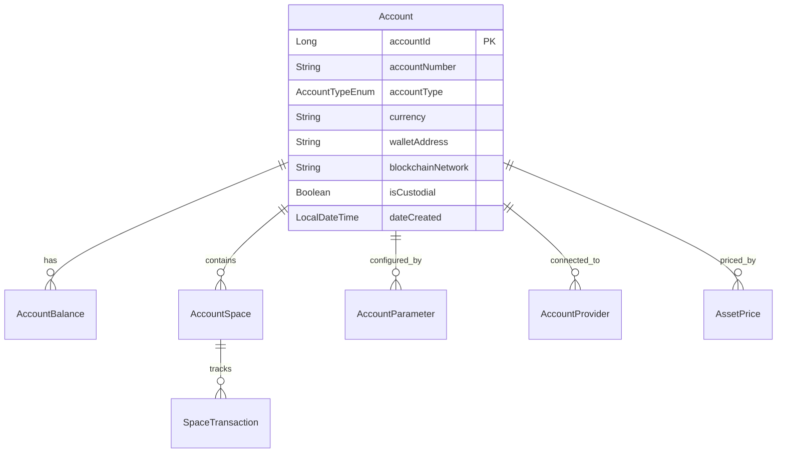
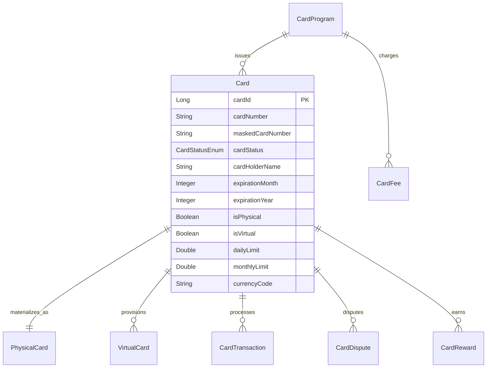
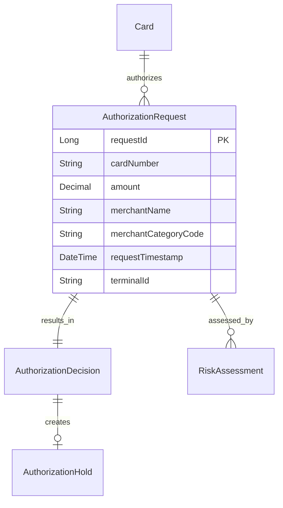

# Core Banking Services Layer - Deep Dive

## Overview

The Core Banking Services Layer represents the fundamental banking operations and services that form the backbone of the Firefly OpenCore Banking Platform. These services handle essential banking functions including account management, payment processing, card services, and ledger operations.

## Service Architecture

### Service Characteristics
- **Reactive Architecture**: Built with Spring WebFlux for non-blocking I/O
- **Event-Driven**: Publishes and consumes domain events via Apache Kafka
- **API-First**: OpenAPI 3.0 specifications with auto-generated SDKs
- **Multi-Module Structure**: Consistent modular organization across services
- **Database-per-Service**: PostgreSQL with R2DBC for reactive database access

### Module Structure (Standard across all services)
```
service-name/
├── service-name-interfaces/    # DTOs, enums, API contracts
├── service-name-models/        # Entities, repositories, data access
├── service-name-core/         # Business logic, services, domain rules
├── service-name-web/          # REST controllers, security, configuration
├── service-name-sdk/          # Auto-generated client SDK
└── pom.xml                    # Maven configuration
```

## Core Banking Services

Based on the actual codebase analysis, here are the confirmed core banking services:

### 1. core-banking-accounts

**Purpose**: Comprehensive account lifecycle management supporting traditional and digital banking accounts.

#### Key Capabilities
- **Multi-Product Support**: Checking, savings, term deposits, credit lines
- **Crypto & Digital Assets**: Bitcoin wallets, tokenized assets, NFT collections, stablecoins
- **Account Spaces**: Sub-account organization for goal-based saving
- **Balance Management**: Real-time balance tracking with multiple balance types
- **Parameter Configuration**: Flexible account parameters with temporal validity
- **Provider Integration**: External banking provider connections
- **Audit Trail**: Complete account operation history
- **Restriction Management**: Account holds and restrictions

#### Data Model Highlights


#### API Endpoints
- `POST /api/v1/accounts` - Create account
- `GET /api/v1/accounts/{accountId}` - Retrieve account details
- `POST /api/v1/accounts/{accountId}/balances` - Manage balances
- `POST /api/v1/account-spaces` - Create account spaces
- `GET /api/v1/asset-prices/asset/{symbol}/latest` - Get latest asset prices

#### Integration Points
- **Customer Management**: Links to customer records via contractId
- **Product Management**: Account type definitions and configurations
- **Ledger Service**: Balance updates and transaction posting
- **Notification Service**: Account alerts and notifications

### 2. core-banking-cards

**Purpose**: Complete card lifecycle management from issuance to transaction processing.

#### Key Capabilities
- **Card Program Management**: Flexible card program configurations
- **Multi-Type Support**: Physical cards, virtual cards, prepaid, credit, debit
- **Card Production**: Manufacturing workflow and shipping tracking
- **Transaction Authorization**: Real-time authorization decisions
- **Digital Wallet Integration**: Apple Pay, Google Pay, Samsung Pay
- **Fraud Detection**: Risk-based transaction screening
- **Dispute Management**: Chargeback and dispute resolution
- **Reward Programs**: Points accumulation and redemption

#### Data Model Highlights


#### API Endpoints
- `POST /api/v1/cards` - Issue new card
- `GET /api/v1/cards/{cardId}` - Card details
- `PUT /api/v1/cards/{cardId}/status` - Update card status
- `POST /api/v1/cards/{cardId}/transactions` - Process transaction
- `GET /api/v1/card-programs` - List card programs

#### Integration Points
- **Account Service**: Links cards to customer accounts
- **Authorization Center**: Real-time transaction authorization
- **Customer Service**: Cardholder information
- **Payment Hub**: Transaction routing and settlement

### 3. core-banking-payments

**Purpose**: Multi-rail payment processing and orchestration platform.

#### Key Capabilities
- **Payment Initiation**: Multiple payment types (SEPA, ACH, wire transfers)
- **Real-time Payments**: Instant payment processing
- **Batch Processing**: Bulk payment processing
- **Payment Status Tracking**: End-to-end payment visibility
- **Fee Calculation**: Dynamic fee computation
- **FX Integration**: Currency conversion support
- **Compliance Screening**: AML/sanctions checking
- **Settlement Management**: Payment settlement tracking

#### API Endpoints
- `POST /api/v1/payments` - Initiate payment
- `GET /api/v1/payments/{paymentId}` - Payment status
- `POST /api/v1/payments/{paymentId}/cancel` - Cancel payment
- `GET /api/v1/payments/batch/{batchId}` - Batch status
- `POST /api/v1/payments/bulk` - Bulk payment initiation

#### Integration Points
- **Account Service**: Debit/credit account balances
- **Payment Hub**: Payment routing decisions
- **Ledger Service**: Transaction recording
- **Compliance Service**: AML screening

### 4. core-banking-ledger

**Purpose**: Double-entry bookkeeping and general ledger management.

#### Key Capabilities
- **Double-Entry Accounting**: Balanced journal entries
- **Chart of Accounts**: Configurable account hierarchies
- **Multi-Currency Support**: Currency-specific ledgers
- **Real-time Posting**: Immediate transaction recording
- **Balance Calculation**: Real-time balance computation
- **Period Close**: End-of-period accounting procedures
- **Reconciliation Support**: External account reconciliation
- **Audit Trail**: Complete transaction history

#### API Endpoints
- `POST /api/v1/journal-entries` - Post journal entry
- `GET /api/v1/accounts/{accountCode}/balance` - Account balance
- `POST /api/v1/trial-balance` - Generate trial balance
- `GET /api/v1/chart-of-accounts` - Account hierarchy
- `POST /api/v1/period-close` - Close accounting period

#### Integration Points
- **All Core Services**: Receives transaction postings
- **Accounting Service**: General ledger integration
- **Reporting Service**: Financial reporting data
- **Audit Service**: Transaction audit trails

### 5. core-banking-payment-hub

**Purpose**: Payment routing, switching, and settlement orchestration.

#### Key Capabilities
- **Payment Routing**: Intelligent payment rail selection
- **Multi-Rail Support**: Integration with various payment networks
- **Settlement Management**: Net settlement calculations
- **Exception Handling**: Failed payment processing
- **SLA Management**: Service level agreement monitoring
- **Cost Optimization**: Least-cost routing algorithms
- **Network Redundancy**: Failover and backup routing
- **Real-time Monitoring**: Payment flow visibility

#### API Endpoints
- `POST /api/v1/routing/payments` - Route payment
- `GET /api/v1/routing/rules` - Routing rules
- `POST /api/v1/settlement/batches` - Create settlement batch
- `GET /api/v1/networks/status` - Network status
- `POST /api/v1/exceptions/{paymentId}` - Handle exception

#### Integration Points
- **Payment Service**: Payment routing decisions
- **Account Service**: Settlement account updates
- **External Networks**: Payment rail connections
- **Monitoring Service**: SLA and performance tracking

### 6. core-banking-psdx

**Purpose**: PSD2 compliance and Open Banking API implementation.

#### Key Capabilities
- **Account Information Service (AIS)**: Account data access
- **Payment Initiation Service (PIS)**: Third-party payment initiation
- **Confirmation of Availability of Funds (CAF)**: Balance verification
- **Strong Customer Authentication (SCA)**: Multi-factor authentication
- **TPP Registration**: Third-party provider management
- **Consent Management**: Customer consent lifecycle
- **API Rate Limiting**: Usage quota management
- **Regulatory Reporting**: PSD2 compliance reporting

#### API Endpoints
- `GET /api/v2/accounts` - List accounts (AIS)
- `GET /api/v2/accounts/{accountId}/balances` - Account balances
- `POST /api/v2/payments` - Initiate payment (PIS)
- `POST /api/v2/funds-confirmations` - Confirm funds (CAF)
- `POST /api/v2/consents` - Create consent
- `GET /api/v2/consents/{consentId}` - Consent status

#### Integration Points
- **Account Service**: Account data retrieval
- **Payment Service**: Payment initiation
- **Customer Service**: Customer authentication
- **SCA Service**: Strong customer authentication
- **Consent Service**: Consent management

### 7. core-banking-card-transaction-authorization-center

**Purpose**: Real-time card transaction authorization engine.

#### Key Capabilities
- **Real-time Authorization**: Sub-second authorization decisions
- **Risk Assessment**: Fraud detection and scoring
- **Limit Checking**: Daily, monthly, per-transaction limits
- **Balance Verification**: Available funds checking
- **Merchant Validation**: Merchant category restrictions
- **Velocity Checking**: Transaction frequency analysis
- **Hold Management**: Authorization hold lifecycle
- **Decline Reasoning**: Detailed decline reason codes

#### Data Model Highlights


#### API Endpoints
- `POST /api/v1/authorizations` - Process authorization
- `GET /api/v1/authorizations/{requestId}` - Authorization details
- `POST /api/v1/authorizations/{requestId}/reverse` - Reverse authorization
- `POST /api/v1/holds/{holdId}/capture` - Capture authorization
- `POST /api/v1/holds/{holdId}/release` - Release authorization

#### Integration Points
- **Card Service**: Card validation and limits
- **Account Service**: Balance verification
- **Fraud Service**: Risk scoring
- **Merchant Service**: Merchant validation
- **Ledger Service**: Authorization posting

## Service Interaction Patterns

### Synchronous Interactions
- **Account Balance Queries**: Real-time balance checks
- **Card Authorization**: Sub-second authorization decisions
- **Payment Validation**: Pre-processing payment validation
- **Ledger Posting**: Immediate transaction recording

### Asynchronous Interactions
- **Transaction Notifications**: Account balance change events
- **Card Status Updates**: Card lifecycle state changes
- **Payment Completion**: Payment settlement notifications
- **Ledger Reconciliation**: End-of-day reconciliation events

### Event Schemas (Examples)

#### Account Balance Changed Event
```json
{
  "eventType": "AccountBalanceChanged",
  "accountId": "550e8400-e29b-41d4-a716-446655440000",
  "previousBalance": 1000.00,
  "newBalance": 1150.00,
  "transactionId": "txn-123456",
  "currency": "EUR",
  "timestamp": "2023-12-01T10:30:00Z"
}
```

#### Card Transaction Authorized Event
```json
{
  "eventType": "CardTransactionAuthorized",
  "cardId": "card-789012",
  "authorizationId": "auth-345678",
  "amount": 25.50,
  "currency": "USD",
  "merchantName": "Coffee Shop",
  "merchantCategoryCode": "5814",
  "timestamp": "2023-12-01T10:30:00Z"
}
```

## Performance & Scalability

### Performance Targets
- **Card Authorization**: < 100ms response time
- **Payment Processing**: < 2s end-to-end
- **Account Balance Query**: < 50ms response time
- **Throughput**: 10,000+ TPS per service

### Scalability Strategies
- **Horizontal Scaling**: Kubernetes HPA based on CPU/memory
- **Connection Pooling**: Optimized database connections
- **Caching**: Redis for frequently accessed data
- **Read Replicas**: Database read scaling
- **Event Streaming**: Kafka for async processing

### Monitoring & Observability

#### Key Metrics
- **Business Metrics**: Transaction volumes, success rates, fraud detection rates
- **Technical Metrics**: Response times, error rates, resource utilization
- **SLA Metrics**: Availability, performance, capacity

#### Health Checks
- **Liveness Probes**: Service health status
- **Readiness Probes**: Service readiness for traffic
- **Dependency Checks**: Database, Kafka, external service health

## Security Considerations

### Data Protection
- **PCI DSS Compliance**: Secure card data handling
- **Data Encryption**: At-rest and in-transit encryption
- **PII Protection**: Personally identifiable information security
- **Tokenization**: Sensitive data tokenization

### Access Control
- **OAuth2/OIDC**: Service-to-service authentication
- **RBAC**: Role-based access control
- **mTLS**: Mutual TLS for service communication
- **API Rate Limiting**: Prevent abuse and ensure fair usage

### Audit & Compliance
- **Transaction Logs**: Complete audit trail
- **Regulatory Reporting**: Automated compliance reporting
- **Data Lineage**: Transaction traceability
- **Retention Policies**: Data lifecycle management

## Deployment Considerations

### Environment Strategy
- **Development**: Local development with TestContainers
- **Testing**: Automated testing with CI/CD pipelines
- **Staging**: Pre-production environment validation
- **Production**: Blue-green deployment strategy

### Configuration Management
- **Environment Variables**: Runtime configuration
- **Config Maps**: Kubernetes configuration management
- **Secrets**: Secure credential management
- **Feature Flags**: Runtime feature toggles

### Disaster Recovery
- **Database Backups**: Automated backup strategies
- **Multi-Region Deployment**: Geographic redundancy
- **Failover Procedures**: Automated failover mechanisms
- **Recovery Testing**: Regular disaster recovery drills

This Core Banking Services Layer provides the essential foundation for modern banking operations while maintaining the flexibility to support both traditional banking and emerging fintech use cases.
