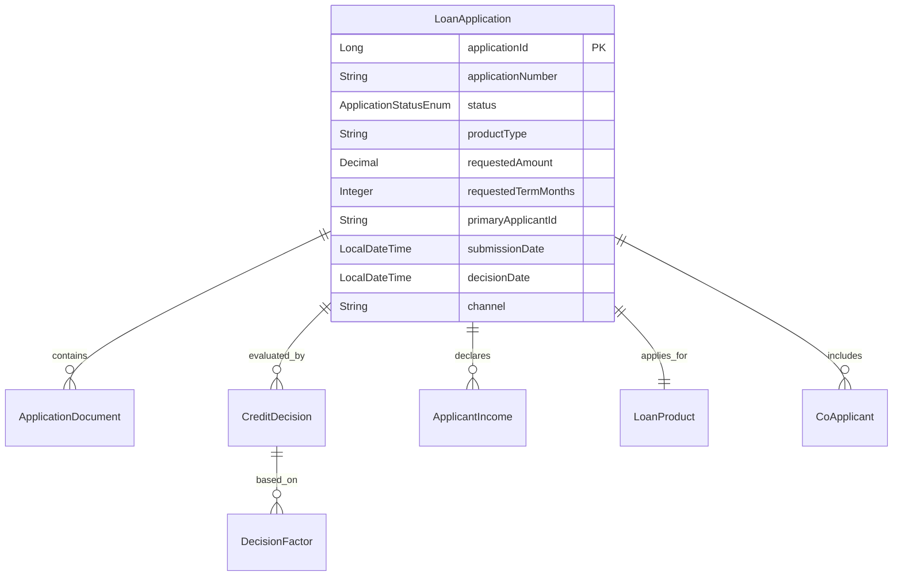
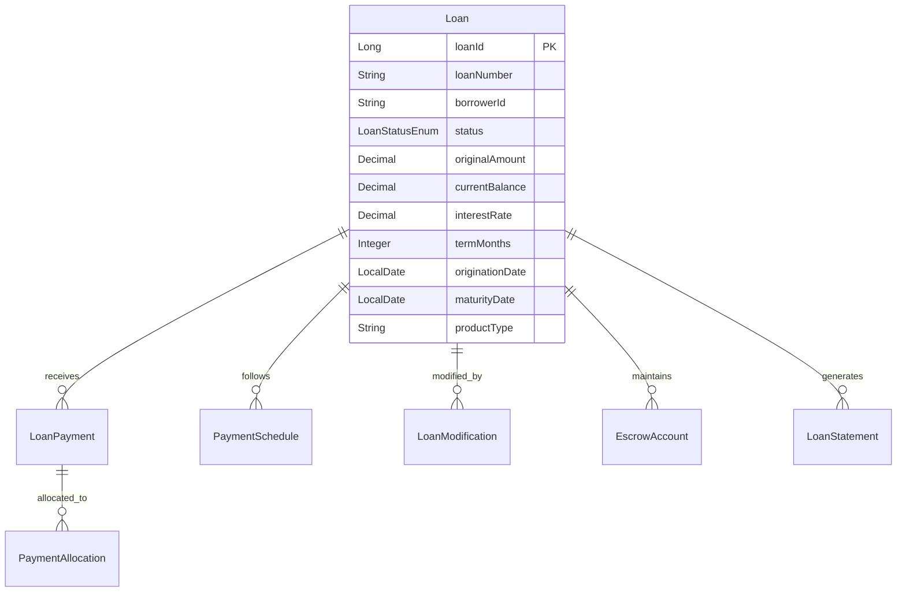
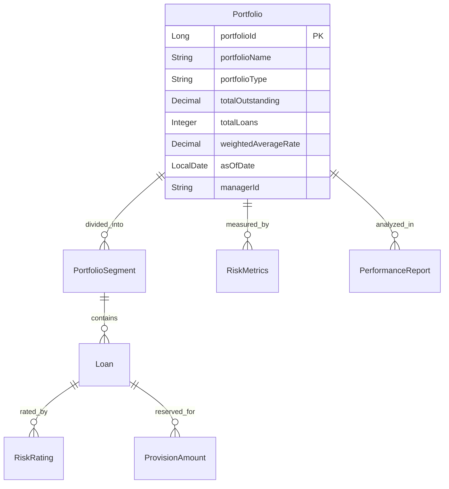
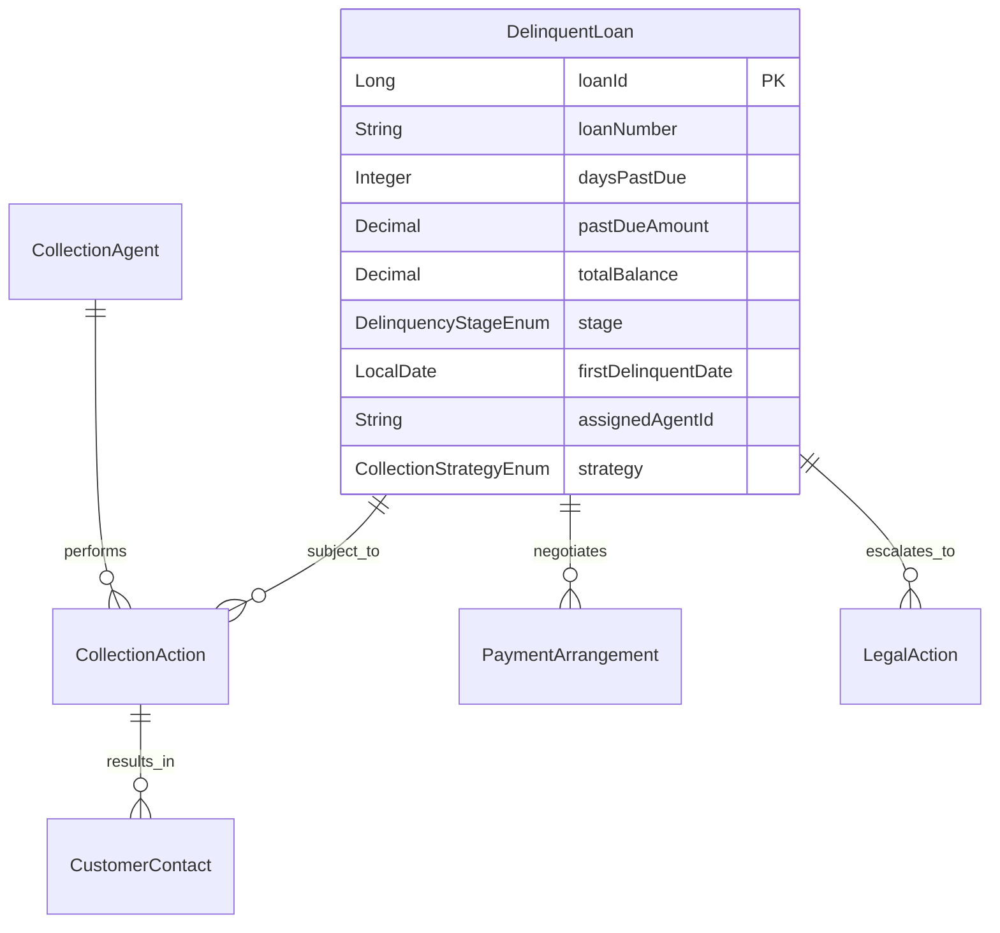
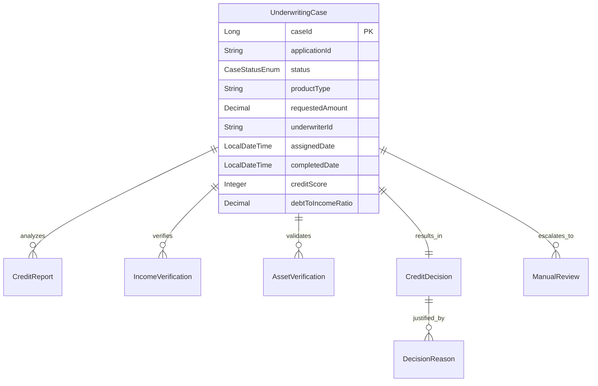
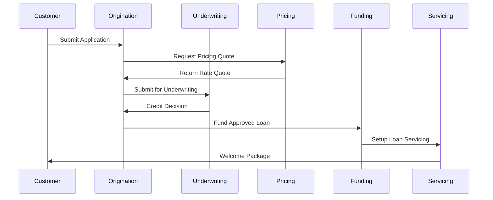
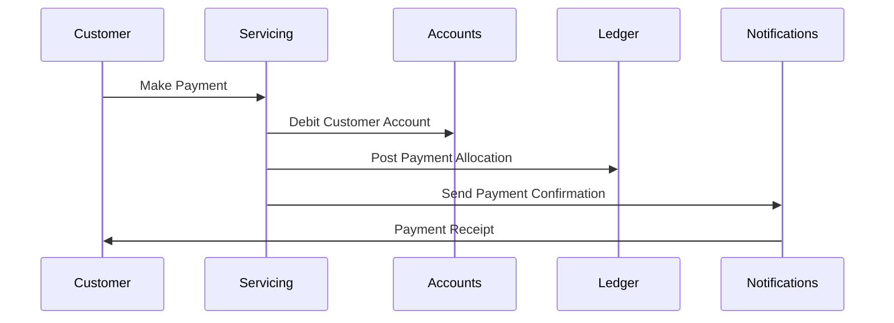
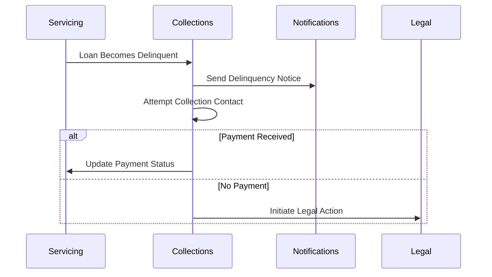

# Core Lending Services Layer - Deep Dive

## Overview

The Core Lending Services Layer encompasses the comprehensive lending operations of the Firefly OpenCore Banking Platform. This layer handles the full lending lifecycle from application origination through servicing, collections, and portfolio management, supporting both traditional and modern lending products.

## Service Architecture

### Service Characteristics
- **Reactive Architecture**: Built with Spring WebFlux for non-blocking I/O operations
- **Event-Driven**: Publishes and consumes lending domain events via Apache Kafka
- **Workflow-Centric**: State machine-based lending process orchestration
- **Risk-Aware**: Integrated risk assessment and decisioning capabilities
- **Compliance-Ready**: Built-in regulatory reporting and audit capabilities
- **Multi-Product Support**: Flexible architecture supporting various lending products

### Module Structure (Standard across all lending services)
```
lending-service-name/
├── lending-service-name-interfaces/  # DTOs, enums, API contracts
├── lending-service-name-models/      # Entities, repositories, data access
├── lending-service-name-core/        # Business logic, workflow engines
├── lending-service-name-web/         # REST controllers, security
├── lending-service-name-sdk/         # Auto-generated client SDK
└── pom.xml                          # Maven configuration
```

## Core Lending Services

Based on the actual codebase analysis, here are the confirmed core lending services:

### 1. core-lending-loan-servicing

**Purpose**: Loan servicing operations management after disbursement, including repayment tracking, case management, and servicing events.

#### Key Capabilities
- **Multi-Channel Application Intake**: Web, mobile, API, partner channels
- **Product Catalog Integration**: Dynamic product offerings and terms
- **Document Collection**: Digital document upload and verification
- **Credit Decision Engine**: Automated underwriting with manual override
- **Application Workflow**: Configurable approval workflows
- **KYC/AML Integration**: Identity verification and compliance checking
- **Pre-Qualification**: Soft credit checks for product matching
- **Co-Applicant Processing**: Joint application handling

#### Data Model Highlights


#### API Endpoints
- `POST /api/v1/applications` - Submit loan application
- `GET /api/v1/applications/{applicationId}` - Application status
- `POST /api/v1/applications/{applicationId}/documents` - Upload documents
- `POST /api/v1/applications/{applicationId}/underwrite` - Trigger underwriting
- `GET /api/v1/products` - Available loan products
- `POST /api/v1/prequalify` - Pre-qualification check

#### Integration Points
- **Customer Service**: Applicant data and verification
- **Product Service**: Loan product configurations and terms
- **Credit Bureau**: Credit report retrieval
- **Document Service**: Document storage and verification
- **Decision Engine**: Credit risk assessment
- **Funding Service**: Loan disbursement

### 2. core-lending-servicing

**Purpose**: Post-origination loan management including payments, modifications, and customer service.

#### Key Capabilities
- **Payment Processing**: Automatic and manual payment processing
- **Amortization Scheduling**: Payment schedule generation and management
- **Balance Management**: Principal, interest, fee tracking
- **Loan Modifications**: Rate changes, term extensions, payment deferrals
- **Escrow Management**: Property tax and insurance escrow accounts
- **Customer Communications**: Statements, notices, alerts
- **Delinquency Management**: Late payment tracking and workflows
- **Payoff Processing**: Loan payoff calculations and processing

#### Data Model Highlights


#### API Endpoints
- `GET /api/v1/loans/{loanId}` - Loan details and balance
- `POST /api/v1/loans/{loanId}/payments` - Process payment
- `GET /api/v1/loans/{loanId}/schedule` - Payment schedule
- `POST /api/v1/loans/{loanId}/modifications` - Request modification
- `GET /api/v1/loans/{loanId}/statements` - Generate statement
- `POST /api/v1/loans/{loanId}/payoff` - Calculate payoff amount

#### Integration Points
- **Account Service**: Payment account debiting
- **Payment Hub**: Payment processing and routing
- **Customer Service**: Borrower information and communications
- **Collections Service**: Delinquent account handoff
- **Ledger Service**: Loan accounting entries
- **Regulatory Reporting**: Loan performance data

### 3. core-lending-portfolio-management

**Purpose**: Comprehensive portfolio analytics, risk management, and performance monitoring.

#### Key Capabilities
- **Portfolio Analytics**: Performance metrics and reporting
- **Risk Assessment**: Portfolio risk profiling and stress testing
- **Concentration Analysis**: Exposure limits and diversification metrics
- **Vintage Analysis**: Cohort performance tracking
- **Provisioning Calculation**: CECL/IFRS 9 loss provisioning
- **Securitization Support**: Pool selection and analysis
- **Regulatory Capital**: Risk-weighted asset calculations
- **Early Warning Systems**: Deteriorating loan identification

#### Data Model Highlights


#### API Endpoints
- `GET /api/v1/portfolios` - List portfolios
- `GET /api/v1/portfolios/{portfolioId}/metrics` - Portfolio metrics
- `POST /api/v1/portfolios/{portfolioId}/stress-test` - Run stress test
- `GET /api/v1/portfolios/{portfolioId}/vintage-analysis` - Vintage performance
- `POST /api/v1/provisioning/calculate` - Calculate provisions
- `GET /api/v1/risk-ratings/distribution` - Risk rating distribution

#### Integration Points
- **Servicing Service**: Loan performance data
- **Risk Engine**: Risk scoring and rating models
- **Accounting Service**: Financial reporting integration
- **Regulatory Reporting**: Compliance data feeds
- **Data Lake**: Analytics and ML model training
- **Treasury Service**: Capital planning and ALM

### 4. core-lending-collections

**Purpose**: Delinquent loan management and recovery operations.

#### Key Capabilities
- **Delinquency Workflow**: Automated collection sequences
- **Communication Management**: Multi-channel customer outreach
- **Payment Arrangements**: Workout plans and payment agreements
- **Skip Tracing**: Customer location services
- **Legal Action Management**: Foreclosure and repossession workflows
- **Recovery Tracking**: Collection performance metrics
- **Compliance Management**: FDCPA, TCPA compliance
- **Third-Party Integration**: External collection agency management

#### Data Model Highlights


#### API Endpoints
- `GET /api/v1/collections/delinquent-loans` - List delinquent loans
- `POST /api/v1/collections/{loanId}/actions` - Log collection action
- `POST /api/v1/collections/{loanId}/payment-arrangement` - Create payment plan
- `GET /api/v1/collections/{loanId}/history` - Collection history
- `POST /api/v1/collections/{loanId}/legal-action` - Initiate legal proceedings
- `GET /api/v1/collections/performance` - Collection metrics

#### Integration Points
- **Servicing Service**: Delinquency status and payment data
- **Customer Service**: Borrower contact information
- **Communication Service**: Multi-channel messaging
- **Legal Service**: Legal action processing
- **External Agencies**: Third-party collection services
- **Compliance Service**: Regulatory compliance checking

### 5. core-lending-underwriting

**Purpose**: Automated and manual credit decision processing with risk assessment.

#### Key Capabilities
- **Decision Engine**: Rule-based and ML-driven underwriting
- **Credit Bureau Integration**: Multi-bureau credit report aggregation
- **Income Verification**: Employment and income validation
- **Asset Verification**: Bank account and asset validation
- **Debt-to-Income Calculation**: DTI and other ratio calculations
- **Fraud Detection**: Application fraud screening
- **Policy Engine**: Product-specific underwriting guidelines
- **Manual Review Queue**: Exception handling and override management

#### Data Model Highlights


#### API Endpoints
- `POST /api/v1/underwriting/cases` - Create underwriting case
- `GET /api/v1/underwriting/cases/{caseId}` - Case details
- `POST /api/v1/underwriting/cases/{caseId}/decision` - Submit decision
- `GET /api/v1/underwriting/queue` - Manual review queue
- `POST /api/v1/underwriting/cases/{caseId}/credit-report` - Order credit report
- `POST /api/v1/underwriting/cases/{caseId}/verify-income` - Verify income

#### Integration Points
- **Origination Service**: Application data and documents
- **Credit Bureau**: Credit report services
- **Verification Services**: Income and asset verification
- **Fraud Detection**: Application fraud scoring
- **Decision Service**: Rule engine and ML models
- **Document Service**: Supporting documentation

### 6. core-lending-pricing

**Purpose**: Dynamic loan pricing and rate determination based on risk and market conditions.

#### Key Capabilities
- **Risk-Based Pricing**: Credit score and profile-based rate adjustment
- **Market Rate Integration**: Real-time market rate feeds
- **Product Configuration**: Rate matrices and pricing parameters
- **Competitive Analysis**: Market positioning and rate comparison
- **Margin Management**: Profit margin optimization
- **Rate Lock Management**: Rate commitment tracking
- **Pricing Analytics**: Performance and profitability analysis
- **A/B Testing**: Pricing strategy experimentation

#### API Endpoints
- `POST /api/v1/pricing/quote` - Generate loan quote
- `GET /api/v1/pricing/rates/{productType}` - Current rates
- `POST /api/v1/pricing/rate-lock` - Lock rate for application
- `GET /api/v1/pricing/market-rates` - Market rate benchmarks
- `POST /api/v1/pricing/analysis` - Pricing performance analysis

#### Integration Points
- **Product Service**: Product definitions and parameters
- **Risk Engine**: Credit risk scoring
- **Market Data**: External rate feeds
- **Origination Service**: Application pricing
- **Analytics Service**: Performance tracking
- **Treasury Service**: Cost of funds data

## Service Interaction Patterns

### Origination Flow


### Payment Processing Flow


### Collections Workflow


## Event Schemas

### Loan Originated Event
```json
{
  "eventType": "LoanOriginated",
  "loanId": "loan-123456",
  "loanNumber": "LN001234567890",
  "borrowerId": "customer-789012",
  "principalAmount": 250000.00,
  "interestRate": 4.25,
  "termMonths": 360,
  "productType": "MORTGAGE",
  "originationDate": "2023-12-01",
  "fundingDate": "2023-12-05",
  "timestamp": "2023-12-01T10:30:00Z"
}
```

### Payment Applied Event
```json
{
  "eventType": "PaymentApplied",
  "loanId": "loan-123456",
  "paymentId": "payment-345678",
  "paymentAmount": 1500.00,
  "principalAmount": 800.50,
  "interestAmount": 687.50,
  "escrowAmount": 12.00,
  "paymentDate": "2023-12-01",
  "currentBalance": 249199.50,
  "timestamp": "2023-12-01T15:30:00Z"
}
```

### Delinquency Status Changed Event
```json
{
  "eventType": "DelinquencyStatusChanged",
  "loanId": "loan-123456",
  "previousStatus": "CURRENT",
  "newStatus": "30_DAYS_PAST_DUE",
  "daysPastDue": 32,
  "pastDueAmount": 1500.00,
  "totalBalance": 248500.00,
  "delinquencyDate": "2023-11-30",
  "timestamp": "2023-12-01T08:00:00Z"
}
```

## Performance & Scalability

### Performance Targets
- **Application Processing**: < 5 minutes automated decision
- **Payment Processing**: < 10 seconds payment application
- **Balance Inquiry**: < 100ms response time
- **Portfolio Analytics**: < 30 seconds for standard reports

### Scalability Strategies
- **Read Replicas**: Separate read/write workloads
- **Event Sourcing**: Append-only transaction logs
- **CQRS**: Command-Query Responsibility Segregation
- **Batch Processing**: End-of-day batch operations
- **Caching**: Portfolio metrics and rate data caching

## Risk Management

### Credit Risk
- **Portfolio Diversification**: Exposure limits by segment
- **Stress Testing**: Economic scenario modeling
- **Early Warning Systems**: Deterioration detection
- **Loss Forecasting**: CECL provision modeling

### Operational Risk
- **Data Quality**: Automated data validation
- **Process Controls**: Four-eyes principle on critical decisions
- **Audit Trails**: Complete transaction history
- **Compliance Monitoring**: Regulatory requirement tracking

### Market Risk
- **Interest Rate Risk**: Asset-liability duration matching
- **Liquidity Risk**: Cash flow forecasting
- **Prepayment Risk**: Early payment modeling
- **Credit Migration**: Rating transition matrices

## Regulatory Compliance

### Consumer Protection
- **TILA-RESPA**: Disclosure timing and content requirements
- **Fair Lending**: Disparate impact monitoring
- **FCRA**: Credit report usage compliance
- **TCPA**: Communication consent management

### Safety & Soundness
- **Capital Requirements**: Risk-weighted asset calculations
- **Allowance for Credit Losses**: CECL implementation
- **Concentration Limits**: Portfolio exposure management
- **Stress Testing**: Supervisory scenarios

### Reporting Requirements
- **Call Reports**: Quarterly regulatory filings
- **HMDA**: Home mortgage disclosure reporting
- **CRA**: Community Reinvestment Act compliance
- **Anti-Money Laundering**: Suspicious activity monitoring

## Monitoring & Analytics

### Business Metrics
- **Origination Volume**: Application and funding metrics
- **Portfolio Performance**: Delinquency and charge-off rates
- **Customer Metrics**: Satisfaction and retention rates
- **Profitability**: Net interest margin and ROA

### Operational Metrics
- **Processing Times**: Application cycle time
- **Decision Accuracy**: Override rates and performance
- **Collection Effectiveness**: Recovery rates by strategy
- **System Performance**: Availability and response times

This Core Lending Services Layer provides a comprehensive foundation for modern lending operations while maintaining regulatory compliance and operational excellence.
