# Domain Services Layer - Deep Dive

## Overview

The Domain Services Layer encapsulates specialized business domain logic and capabilities that support specific areas of banking operations. These services represent bounded contexts in the domain-driven design approach, each focusing on a particular business domain while maintaining clear boundaries and responsibilities.

## Domain Architecture

### Domain Characteristics
- **Bounded Context**: Clear domain boundaries with specific business focus
- **Domain-Driven Design**: Rich domain models with business logic encapsulation
- **Event Publishing**: Domain events for cross-domain communication
- **Business Rule Enforcement**: Domain-specific business rules and validation
- **Data Ownership**: Domain-specific data models and persistence
- **Microservice Alignment**: Each domain as independently deployable service

### Module Structure Pattern
```
domain-service/
├── domain-service-interfaces/  # Domain DTOs, events, contracts
├── domain-service-models/      # Domain entities, repositories, aggregates
├── domain-service-core/        # Domain services, business logic
├── domain-service-web/         # Domain APIs, controllers
├── domain-service-sdk/         # Domain client libraries
└── pom.xml                    # Maven configuration
```

## Core Domain Services

### 1. Accounts & Payments Domain

This domain encompasses account-to-account relationships, payment processing workflows, and financial transaction management across multiple subdomains.

#### Subdomains

##### accounts-payments-domain-account-to-account

**Purpose**: Account relationship management and inter-account transaction processing.

**Key Capabilities**:
- **Account Linking**: Establish relationships between accounts
- **Transfer Authorization**: Validate and authorize account transfers
- **Balance Verification**: Real-time balance checking across linked accounts
- **Transfer Limits**: Account-to-account transfer limit enforcement
- **Relationship Management**: Account ownership and beneficiary management
- **Cross-Account Reporting**: Transaction reporting across linked accounts

**Data Model Highlights**:
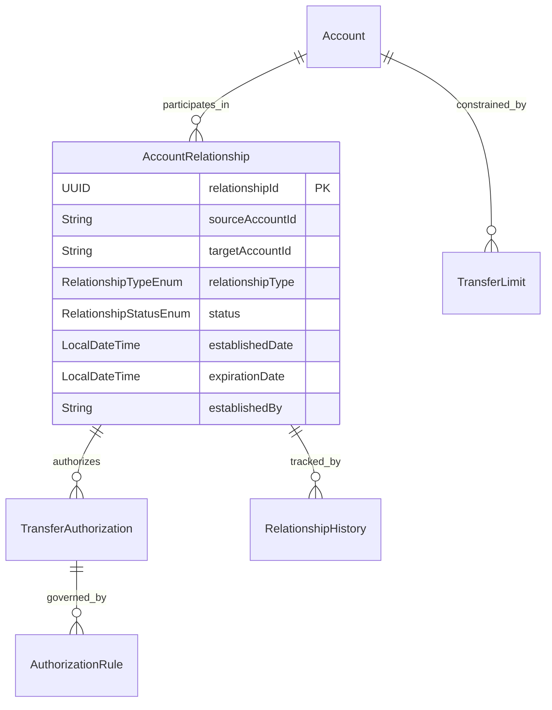

**API Endpoints**:
- `POST /api/v1/account-relationships` - Establish account relationship
- `GET /api/v1/accounts/{accountId}/relationships` - List account relationships
- `POST /api/v1/transfers/authorize` - Authorize account transfer
- `GET /api/v1/transfers/{transferId}/status` - Transfer authorization status
- `PUT /api/v1/account-relationships/{relationshipId}/limits` - Update transfer limits

##### accounts-payments-domain-payment-methods

**Purpose**: Payment method management and payment instrument handling.

**Key Capabilities**:
- **Payment Method Registration**: Add and verify payment methods
- **Payment Instrument Validation**: Validate payment instruments (cards, ACH, etc.)
- **Default Payment Method**: Manage customer preferred payment methods
- **Payment Method Security**: Tokenization and secure storage
- **Expiration Management**: Payment method lifecycle and renewal
- **Multi-Channel Support**: Payment methods across different channels

**Data Model Highlights**:
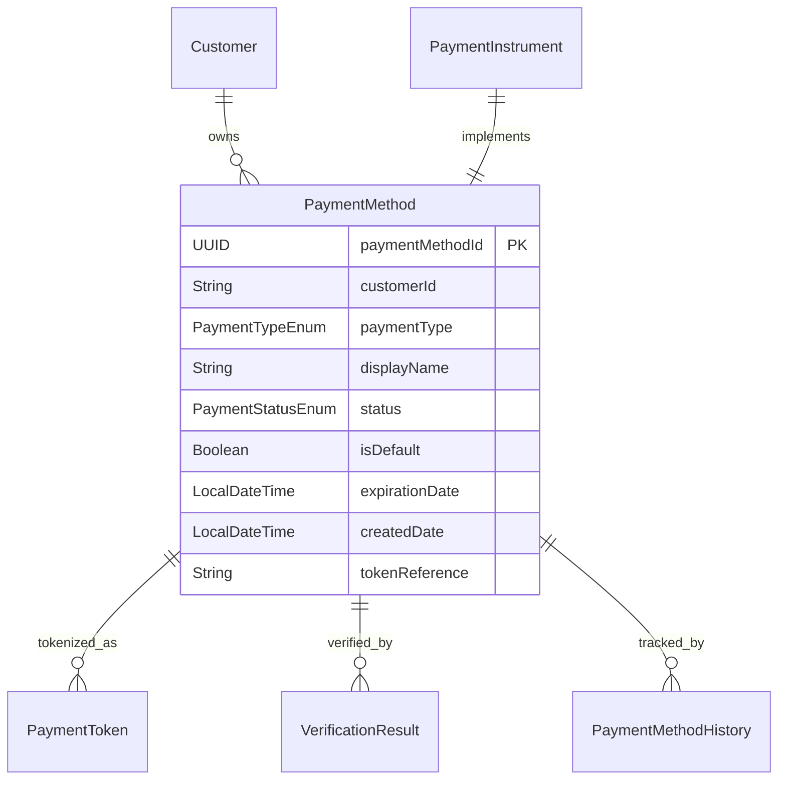

**API Endpoints**:
- `POST /api/v1/payment-methods` - Register payment method
- `GET /api/v1/customers/{customerId}/payment-methods` - List customer payment methods
- `POST /api/v1/payment-methods/{methodId}/verify` - Verify payment method
- `PUT /api/v1/payment-methods/{methodId}/default` - Set default payment method
- `DELETE /api/v1/payment-methods/{methodId}` - Remove payment method

##### accounts-payments-domain-payment-processing

**Purpose**: Core payment processing workflows and transaction orchestration.

**Key Capabilities**:
- **Payment Initiation**: Multi-channel payment initiation
- **Payment Validation**: Payment request validation and fraud screening
- **Payment Routing**: Intelligent payment routing and rail selection
- **Payment Execution**: Payment processing and settlement coordination
- **Payment Status Tracking**: Real-time payment status updates
- **Payment Reconciliation**: Payment matching and exception handling
- **Regulatory Compliance**: AML/KYC validation and reporting

**API Endpoints**:
- `POST /api/v1/payments/initiate` - Initiate payment
- `GET /api/v1/payments/{paymentId}` - Payment details and status
- `POST /api/v1/payments/{paymentId}/cancel` - Cancel payment
- `GET /api/v1/payments/batch/{batchId}` - Batch payment status
- `POST /api/v1/payments/reconcile` - Reconcile payments

### 2. Customer Domain

#### customer-domain-individual

**Purpose**: Individual customer lifecycle management and personal banking services.

**Key Capabilities**:
- **Individual Profile Management**: Personal customer information
- **Identity Verification**: KYC/AML for individual customers
- **Relationship Management**: Family and household relationships
- **Privacy Preferences**: Personal data privacy and consent management
- **Life Event Processing**: Marriage, divorce, address changes
- **Credit Profile**: Individual credit history and scoring
- **Product Eligibility**: Individual product qualification assessment

**Data Model Highlights**:
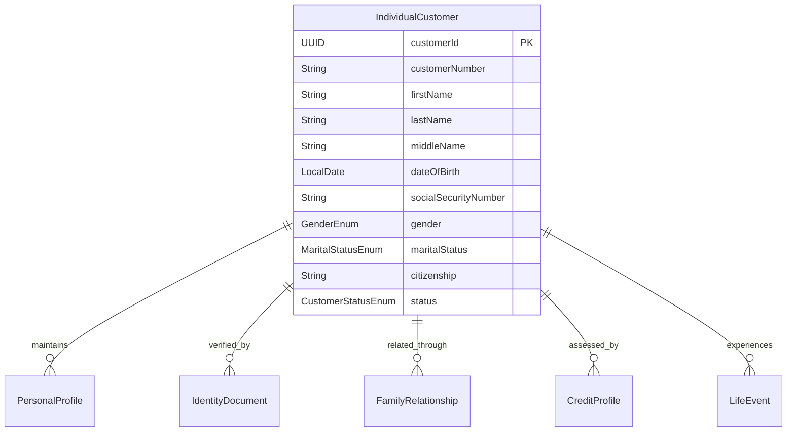

**API Endpoints**:
- `POST /api/v1/customers/individual` - Create individual customer
- `GET /api/v1/customers/individual/{customerId}` - Individual customer details
- `PUT /api/v1/customers/individual/{customerId}/profile` - Update personal profile
- `POST /api/v1/customers/individual/{customerId}/life-events` - Record life event
- `GET /api/v1/customers/individual/{customerId}/relationships` - Family relationships

#### customer-domain-business

**Purpose**: Business customer management and commercial banking services.

**Key Capabilities**:
- **Business Profile Management**: Commercial entity information
- **Business Verification**: Business identity and authorization verification
- **Entity Structure**: Complex business entity relationships
- **Authorized Signers**: Business account authorization management
- **Compliance Monitoring**: Commercial customer compliance tracking
- **Business Credit**: Commercial credit assessment and monitoring
- **Industry Classification**: Business type and industry categorization

**Data Model Highlights**:
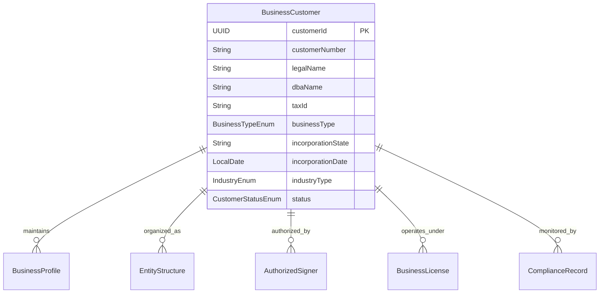

**API Endpoints**:
- `POST /api/v1/customers/business` - Create business customer
- `GET /api/v1/customers/business/{customerId}` - Business customer details
- `POST /api/v1/customers/business/{customerId}/signers` - Add authorized signer
- `PUT /api/v1/customers/business/{customerId}/entity-structure` - Update entity structure
- `GET /api/v1/customers/business/{customerId}/compliance` - Compliance monitoring

### 3. Organization Domain

#### organization-domain-branch-management

**Purpose**: Branch and location management for banking operations.

**Key Capabilities**:
- **Branch Network Management**: Branch hierarchy and relationships
- **Location Services**: Geographic branch location services
- **Operating Hours**: Branch hours and holiday schedule management
- **Service Capabilities**: Branch service offerings and capabilities
- **Staff Management**: Branch staffing and role management
- **Performance Tracking**: Branch performance metrics and reporting
- **Customer Assignment**: Customer-branch relationship management

**Data Model Highlights**:
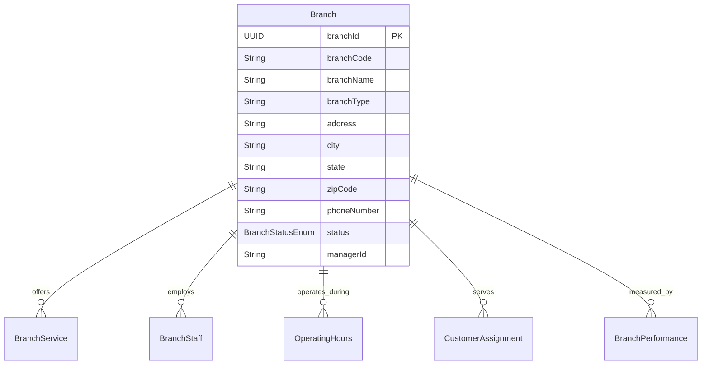

**API Endpoints**:
- `GET /api/v1/branches` - List all branches
- `POST /api/v1/branches` - Create new branch
- `GET /api/v1/branches/{branchId}` - Branch details
- `PUT /api/v1/branches/{branchId}/hours` - Update operating hours
- `GET /api/v1/branches/search` - Branch location search
- `GET /api/v1/branches/{branchId}/performance` - Branch performance metrics

### 4. Product Domain

#### product-domain-catalog

**Purpose**: Financial product catalog management and configuration.

**Key Capabilities**:
- **Product Definition**: Banking product specifications and features
- **Product Configuration**: Configurable product parameters and rules
- **Product Lifecycle**: Product creation, updates, and retirement
- **Eligibility Rules**: Product qualification and eligibility criteria
- **Pricing Configuration**: Product pricing models and fee structures
- **Product Bundling**: Product packages and cross-sell opportunities
- **Regulatory Compliance**: Product regulatory requirements and disclosures

**Data Model Highlights**:
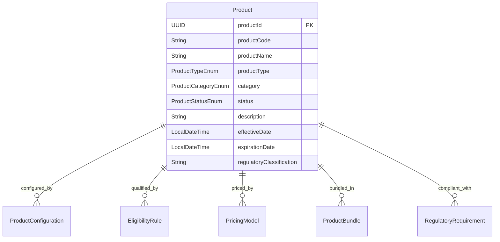

**API Endpoints**:
- `GET /api/v1/products/catalog` - Product catalog listing
- `POST /api/v1/products` - Create new product
- `GET /api/v1/products/{productId}` - Product details
- `PUT /api/v1/products/{productId}/configuration` - Update product configuration
- `GET /api/v1/products/{productId}/eligibility` - Product eligibility rules
- `POST /api/v1/products/{productId}/pricing` - Configure product pricing

### 5. Distributor Domain

#### distributor-domain-partner-management

**Purpose**: Financial services partner and distributor relationship management.

**Key Capabilities**:
- **Partner Onboarding**: Distributor partner onboarding workflows
- **Partnership Agreements**: Contract and agreement management
- **Commission Management**: Partner commission calculation and payment
- **Performance Tracking**: Partner performance metrics and reporting
- **Lead Management**: Partner-generated lead tracking and conversion
- **Compliance Monitoring**: Partner regulatory compliance oversight
- **Training and Certification**: Partner training program management

**Data Model Highlights**:
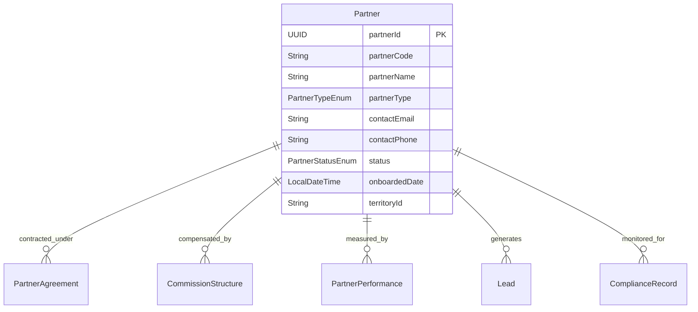

**API Endpoints**:
- `POST /api/v1/partners` - Onboard new partner
- `GET /api/v1/partners/{partnerId}` - Partner details
- `PUT /api/v1/partners/{partnerId}/agreement` - Update partnership agreement
- `GET /api/v1/partners/{partnerId}/performance` - Partner performance metrics
- `POST /api/v1/partners/{partnerId}/leads` - Submit partner lead
- `GET /api/v1/partners/{partnerId}/commissions` - Partner commission reports

### 6. Treasury & Finance Domain

#### treasury-finance-domain-treasury-management

**Purpose**: Treasury operations, liquidity management, and financial risk oversight.

**Key Capabilities**:
- **Liquidity Management**: Cash flow forecasting and liquidity monitoring
- **Investment Portfolio**: Treasury investment management
- **Funding Operations**: Wholesale funding and deposit management
- **Interest Rate Management**: Asset-liability management and hedging
- **Capital Planning**: Regulatory capital planning and optimization
- **Market Risk**: Interest rate and market risk measurement
- **Regulatory Capital**: Capital adequacy and stress testing

**Data Model Highlights**:
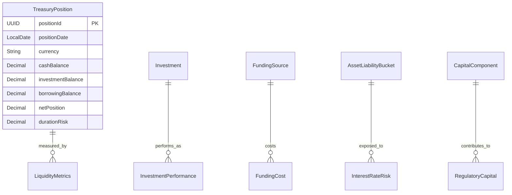

**API Endpoints**:
- `GET /api/v1/treasury/positions` - Treasury position summary
- `POST /api/v1/treasury/investments` - Record treasury investment
- `GET /api/v1/treasury/liquidity/forecast` - Liquidity forecasting
- `GET /api/v1/treasury/risk/interest-rate` - Interest rate risk metrics
- `POST /api/v1/treasury/capital/calculate` - Calculate regulatory capital

### 7. Reporting Data Domain

#### reporting-data-domain-financial-reporting

**Purpose**: Financial reporting data aggregation and regulatory report generation.

**Key Capabilities**:
- **Data Aggregation**: Multi-source financial data consolidation
- **Report Generation**: Automated financial report creation
- **Regulatory Reports**: Compliance reporting for regulatory agencies
- **Performance Analytics**: Financial performance analysis and KPIs
- **Data Quality**: Financial data validation and reconciliation
- **Historical Analysis**: Trend analysis and period-over-period comparisons
- **Real-time Dashboards**: Executive and operational dashboards

**Data Model Highlights**:
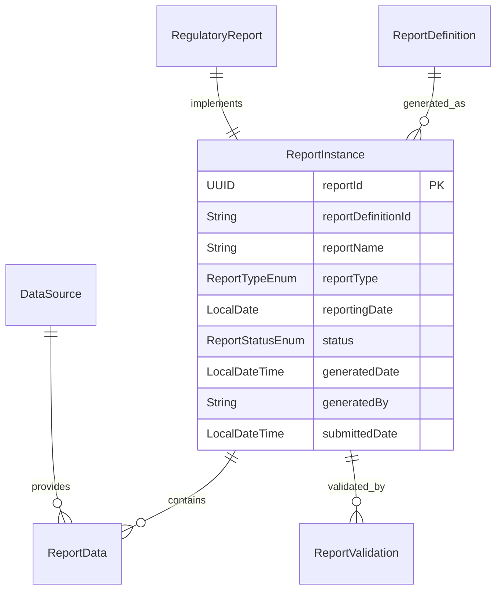

**API Endpoints**:
- `POST /api/v1/reports/generate` - Generate financial report
- `GET /api/v1/reports/{reportId}` - Report details and status
- `GET /api/v1/reports/regulatory/schedule` - Regulatory reporting schedule
- `POST /api/v1/reports/{reportId}/validate` - Validate report data
- `GET /api/v1/reports/performance/dashboard` - Performance dashboard data
- `POST /api/v1/reports/{reportId}/submit` - Submit regulatory report

## Domain Integration Patterns

### Domain Event Publishing
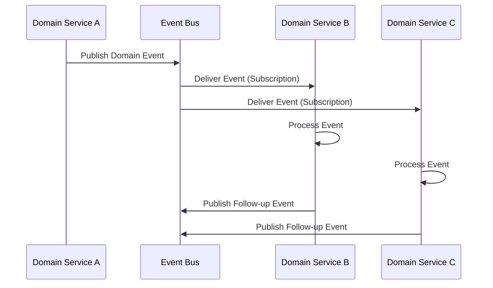

### Cross-Domain Workflow
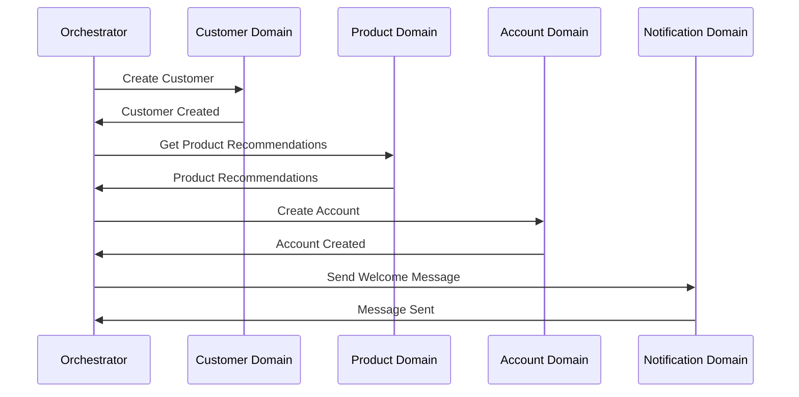

### Eventual Consistency Pattern
- **Domain Events**: Asynchronous domain state synchronization
- **Event Sourcing**: Event-driven state reconstruction
- **CQRS**: Separate read/write models for performance
- **Compensation**: Handle cross-domain transaction failures

## Domain-Specific Patterns

### Customer Domain Patterns
- **Customer Aggregate**: Customer as aggregate root with related entities
- **Identity Resolution**: Customer identity matching and deduplication
- **Relationship Management**: Customer relationship graphs and hierarchies

### Product Domain Patterns
- **Product Configuration**: Template-based product configuration
- **Product Lifecycle**: State machine for product lifecycle management
- **Eligibility Engine**: Rule-based product qualification engine

### Treasury Domain Patterns
- **Position Management**: Aggregate treasury positions across instruments
- **Risk Calculation**: Complex financial risk calculation engines
- **Regulatory Capital**: Multi-tier capital calculation frameworks

## Performance & Scalability

### Domain-Specific Optimizations
- **Read Replicas**: Domain-specific read scaling
- **Caching Strategies**: Domain data caching patterns
- **Event Streaming**: High-throughput domain event processing
- **Data Partitioning**: Domain-based data partitioning strategies

### Performance Targets by Domain
- **Customer Lookup**: < 100ms response time
- **Product Catalog**: < 200ms for product search
- **Payment Processing**: < 2s end-to-end payment
- **Account Operations**: < 500ms for account transactions
- **Reporting**: < 30s for standard reports

## Security & Compliance

### Domain-Specific Security
- **Data Classification**: Domain-specific data sensitivity levels
- **Access Control**: Domain-based role and permission management
- **Data Encryption**: Domain-appropriate encryption strategies
- **Audit Requirements**: Domain-specific audit and compliance needs

### Regulatory Compliance
- **Customer Privacy**: GDPR/CCPA compliance in customer domains
- **Financial Reporting**: SOX compliance in financial reporting domain
- **Anti-Money Laundering**: AML compliance across relevant domains
- **Payment Card Industry**: PCI DSS compliance in payment domains

This Domain Services Layer provides the specialized business logic and domain expertise necessary to implement complex banking operations while maintaining clear domain boundaries and enabling effective cross-domain collaboration.
