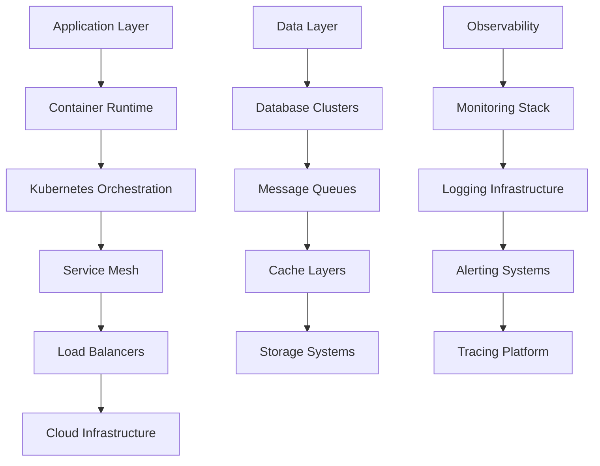

# Infrastructure Layer - Deep Dive

## Overview

The Infrastructure Layer provides the foundational components, deployment strategies, and operational capabilities that support the entire Firefly OpenCore Banking Platform. This layer encompasses containerization, orchestration, monitoring, security, data persistence, and cloud infrastructure management.

## Infrastructure Architecture

### Infrastructure Characteristics
- **Cloud-Native**: Designed for cloud environments with container orchestration
- **Scalable**: Horizontally and vertically scalable infrastructure components
- **Resilient**: High availability and disaster recovery capabilities
- **Secure**: Defense-in-depth security architecture
- **Observable**: Comprehensive monitoring, logging, and alerting
- **Automated**: Infrastructure as Code and automated operations

### Infrastructure Components Stack


## Container Infrastructure

### Container Strategy

#### Docker Containerization
- **Multi-Stage Builds**: Optimized container images
- **Base Images**: Standardized base images for security and consistency
- **Layer Optimization**: Minimal and efficient container layers
- **Security Scanning**: Automated vulnerability scanning

```dockerfile path=null start=null
# Multi-stage build example
FROM openjdk:21-jdk-slim AS build
WORKDIR /app
COPY . .
RUN ./mvnw clean package -DskipTests

FROM openjdk:21-jre-slim AS runtime
RUN addgroup --system appgroup && adduser --system appuser --ingroup appgroup
USER appuser
COPY --from=build /app/target/*.jar app.jar
EXPOSE 8080
ENTRYPOINT ["java", "-jar", "/app.jar"]
```

#### Container Registry
- **Private Registry**: Secure container image storage
- **Image Signing**: Digital signature verification
- **Vulnerability Management**: Automated security scanning
- **Image Lifecycle**: Automated cleanup and retention policies

#### Container Runtime
- **containerd**: Container runtime interface
- **Docker**: Development and local runtime
- **Security Policies**: Runtime security enforcement
- **Resource Limits**: CPU and memory constraints

### Kubernetes Orchestration

#### Cluster Architecture
- **Multi-Zone Deployment**: High availability across zones
- **Node Pools**: Specialized node configurations
- **Auto Scaling**: Horizontal Pod Autoscaler (HPA) and Vertical Pod Autoscaler (VPA)
- **Resource Quotas**: Namespace-level resource management

```yaml path=null start=null
apiVersion: apps/v1
kind: Deployment
metadata:
  name: core-banking-accounts
  namespace: banking-services
spec:
  replicas: 3
  selector:
    matchLabels:
      app: core-banking-accounts
  template:
    metadata:
      labels:
        app: core-banking-accounts
    spec:
      containers:
      - name: app
        image: firefly/core-banking-accounts:latest
        ports:
        - containerPort: 8080
        env:
        - name: SPRING_PROFILES_ACTIVE
          value: "production"
        resources:
          requests:
            memory: "512Mi"
            cpu: "250m"
          limits:
            memory: "1Gi"
            cpu: "500m"
        livenessProbe:
          httpGet:
            path: /actuator/health
            port: 8080
          initialDelaySeconds: 30
          periodSeconds: 10
        readinessProbe:
          httpGet:
            path: /actuator/health/readiness
            port: 8080
          initialDelaySeconds: 10
          periodSeconds: 5
```

#### Service Discovery and Load Balancing
- **Kubernetes Services**: Internal service discovery
- **Ingress Controllers**: External traffic routing
- **Service Mesh**: Advanced traffic management
- **Load Balancing**: Layer 4 and Layer 7 load balancing

#### Configuration Management
- **ConfigMaps**: Non-sensitive configuration data
- **Secrets**: Sensitive configuration and credentials
- **Environment Variables**: Runtime configuration
- **Volume Mounts**: File-based configuration

#### Persistent Storage
- **Persistent Volumes**: Stateful application storage
- **Storage Classes**: Different storage tiers and performance
- **Volume Snapshots**: Data backup and recovery
- **StatefulSets**: Stateful application orchestration

## Service Mesh Infrastructure

### Istio Service Mesh

#### Traffic Management
- **Virtual Services**: Advanced routing rules
- **Destination Rules**: Service-level policies
- **Gateways**: Ingress and egress traffic management
- **Circuit Breakers**: Fault tolerance and resilience

```yaml path=null start=null
apiVersion: networking.istio.io/v1beta1
kind: VirtualService
metadata:
  name: banking-services-routing
spec:
  hosts:
  - api.firefly-banking.com
  gateways:
  - banking-gateway
  http:
  - match:
    - uri:
        prefix: /api/v1/accounts
    route:
    - destination:
        host: core-banking-accounts
        port:
          number: 8080
      weight: 100
    timeout: 30s
    retries:
      attempts: 3
      perTryTimeout: 10s
```

#### Security Policies
- **Mutual TLS**: Automatic service-to-service encryption
- **Authorization Policies**: Fine-grained access control
- **Security Policies**: Network security enforcement
- **Certificate Management**: Automatic certificate rotation

#### Observability
- **Distributed Tracing**: Request flow visibility
- **Metrics Collection**: Service mesh metrics
- **Access Logging**: Detailed request logging
- **Service Graph**: Service dependency visualization

## Data Infrastructure

### Database Infrastructure

#### PostgreSQL Clusters
- **High Availability**: Master-replica setup with automatic failover
- **Read Replicas**: Read-only replicas for query performance
- **Connection Pooling**: PgBouncer for connection management
- **Backup Strategy**: Automated backups with point-in-time recovery

```yaml path=null start=null
apiVersion: postgresql.cnpg.io/v1
kind: Cluster
metadata:
  name: postgres-cluster
spec:
  instances: 3
  postgresql:
    parameters:
      max_connections: "200"
      shared_buffers: "256MB"
      effective_cache_size: "1GB"
  bootstrap:
    initdb:
      database: firefly_banking
      owner: firefly_user
  storage:
    size: 100Gi
    storageClass: fast-ssd
  monitoring:
    enabled: true
```

#### Data Partitioning
- **Horizontal Partitioning**: Table partitioning by date or ID
- **Vertical Partitioning**: Column-based data separation
- **Sharding**: Cross-database data distribution
- **Read/Write Splitting**: Query routing optimization

#### Database Security
- **Encryption at Rest**: Database-level encryption
- **Encryption in Transit**: TLS for database connections
- **Access Control**: Role-based database permissions
- **Audit Logging**: Database activity monitoring

### Message Queue Infrastructure

#### Apache Kafka
- **Cluster Setup**: Multi-broker Kafka cluster
- **Topic Management**: Automated topic creation and management
- **Partition Strategy**: Optimal partition distribution
- **Consumer Groups**: Scalable message consumption

```yaml path=null start=null
apiVersion: kafka.strimzi.io/v1beta2
kind: Kafka
metadata:
  name: firefly-kafka
spec:
  kafka:
    version: 3.5.0
    replicas: 3
    listeners:
      - name: plain
        port: 9092
        type: internal
        tls: false
      - name: tls
        port: 9093
        type: internal
        tls: true
    config:
      offsets.topic.replication.factor: 3
      transaction.state.log.replication.factor: 3
      transaction.state.log.min.isr: 2
      log.message.format.version: "3.5"
    storage:
      type: jbod
      volumes:
      - id: 0
        type: persistent-claim
        size: 100Gi
        class: fast-ssd
  zookeeper:
    replicas: 3
    storage:
      type: persistent-claim
      size: 10Gi
      class: fast-ssd
```

#### Kafka Connect
- **Source Connectors**: Database CDC and external system integration
- **Sink Connectors**: Data streaming to analytics and storage
- **Schema Registry**: Avro schema management
- **Dead Letter Queues**: Failed message handling

### Caching Infrastructure

#### Redis Clusters
- **High Availability**: Redis Sentinel for failover
- **Clustering**: Redis Cluster for horizontal scaling
- **Persistence**: RDB and AOF persistence strategies
- **Memory Management**: Eviction policies and optimization

```yaml path=null start=null
apiVersion: redis.redis.opstreelabs.in/v1beta1
kind: RedisCluster
metadata:
  name: redis-cluster
spec:
  clusterSize: 6
  redisExporter:
    enabled: true
  storage:
    volumeClaimTemplate:
      spec:
        accessModes: ["ReadWriteOnce"]
        resources:
          requests:
            storage: 10Gi
  resources:
    requests:
      memory: 512Mi
      cpu: 250m
    limits:
      memory: 1Gi
      cpu: 500m
```

#### Cache Strategies
- **Application Caching**: In-memory application caches
- **Database Query Caching**: Query result caching
- **Session Storage**: User session management
- **Rate Limiting**: API rate limiting data

## Monitoring and Observability

### Monitoring Stack

#### Prometheus Monitoring
- **Metrics Collection**: Application and infrastructure metrics
- **Service Discovery**: Automatic target discovery
- **Alerting Rules**: Proactive alert conditions
- **Federation**: Multi-cluster metric aggregation

```yaml path=null start=null
apiVersion: monitoring.coreos.com/v1
kind: ServiceMonitor
metadata:
  name: banking-services
  labels:
    app: banking-services
spec:
  selector:
    matchLabels:
      monitoring: enabled
  endpoints:
  - port: http-metrics
    path: /actuator/prometheus
    interval: 30s
    scrapeTimeout: 10s
```

#### Grafana Dashboards
- **Infrastructure Dashboards**: Kubernetes and system metrics
- **Application Dashboards**: Service-specific metrics
- **Business Dashboards**: KPI and business metric visualization
- **Alerting Integration**: Alert visualization and management

#### Key Metrics
- **Golden Signals**: Latency, traffic, errors, saturation
- **Business Metrics**: Transaction volumes, success rates
- **Infrastructure Metrics**: CPU, memory, disk, network
- **Application Metrics**: JVM metrics, connection pools

### Logging Infrastructure

#### Centralized Logging (ELK Stack)
- **Elasticsearch**: Log storage and indexing
- **Logstash**: Log processing and enrichment
- **Kibana**: Log visualization and analysis
- **Filebeat**: Log shipping from containers

```yaml path=null start=null
apiVersion: logging.coreos.com/v1
kind: ClusterLogForwarder
metadata:
  name: firefly-logs
spec:
  outputs:
  - name: elasticsearch-output
    type: elasticsearch
    url: https://elasticsearch.firefly-banking.com:9200
    elasticsearch:
      index: firefly-banking-{.log_type}-{+yyyy.MM.dd}
  pipelines:
  - name: application-logs
    inputRefs:
    - application
    outputs:
    - elasticsearch-output
    filterRefs:
    - json-parser
```

#### Log Management
- **Structured Logging**: JSON-formatted log entries
- **Log Correlation**: Request tracing across services
- **Log Retention**: Automated log lifecycle management
- **Log Security**: Sensitive data redaction

### Distributed Tracing

#### Jaeger Tracing
- **Trace Collection**: Distributed request tracing
- **Span Analysis**: Individual operation performance
- **Service Dependency**: Service interaction mapping
- **Performance Analysis**: Latency and bottleneck identification

#### OpenTelemetry Integration
- **Automatic Instrumentation**: Framework-level instrumentation
- **Custom Spans**: Business operation tracing
- **Context Propagation**: Cross-service context passing
- **Sampling Configuration**: Configurable trace sampling

### Alerting Systems

#### Alert Management
- **Alert Routing**: Alert routing based on severity and teams
- **Escalation Policies**: Multi-level alert escalation
- **Alert Correlation**: Related alert grouping
- **Alert Suppression**: Maintenance window management

```yaml path=null start=null
apiVersion: monitoring.coreos.com/v1
kind: PrometheusRule
metadata:
  name: banking-alerts
spec:
  groups:
  - name: banking.rules
    rules:
    - alert: HighErrorRate
      expr: rate(http_requests_total{status=~"5.."}[5m]) > 0.1
      for: 5m
      labels:
        severity: critical
      annotations:
        summary: "High error rate detected"
        description: "Error rate is {{ $value }} for {{ $labels.service }}"
    
    - alert: DatabaseConnectionHigh
      expr: postgres_connection_count / postgres_max_connections > 0.8
      for: 2m
      labels:
        severity: warning
      annotations:
        summary: "Database connection usage high"
```

## Security Infrastructure

### Network Security

#### Network Policies
- **Microsegmentation**: Pod-to-pod network isolation
- **Ingress Rules**: Inbound traffic control
- **Egress Rules**: Outbound traffic restrictions
- **Default Deny**: Zero-trust network approach

```yaml path=null start=null
apiVersion: networking.k8s.io/v1
kind: NetworkPolicy
metadata:
  name: banking-services-netpol
spec:
  podSelector:
    matchLabels:
      tier: banking
  policyTypes:
  - Ingress
  - Egress
  ingress:
  - from:
    - podSelector:
        matchLabels:
          tier: frontend
    ports:
    - protocol: TCP
      port: 8080
  egress:
  - to:
    - podSelector:
        matchLabels:
          tier: database
    ports:
    - protocol: TCP
      port: 5432
```

#### TLS Management
- **Certificate Authority**: Internal CA for service certificates
- **Certificate Automation**: Automatic certificate generation and rotation
- **Mutual TLS**: Service-to-service authentication
- **Certificate Monitoring**: Certificate expiration monitoring

### Secret Management

#### HashiCorp Vault Integration
- **Secret Storage**: Centralized secret management
- **Dynamic Secrets**: Database credential generation
- **Secret Rotation**: Automated secret rotation
- **Audit Logging**: Secret access auditing

```yaml path=null start=null
apiVersion: secrets-store.csi.x-k8s.io/v1
kind: SecretProviderClass
metadata:
  name: vault-secrets
spec:
  provider: vault
  parameters:
    vaultAddress: "https://vault.firefly-banking.com:8200"
    roleName: "banking-services"
    objects: |
      - objectName: "database-password"
        secretPath: "secret/data/database"
        secretKey: "password"
      - objectName: "api-key"
        secretPath: "secret/data/external-api"
        secretKey: "key"
```

#### Kubernetes Secrets
- **Sealed Secrets**: GitOps-friendly secret management
- **External Secrets**: Integration with external secret stores
- **Secret Encryption**: Encryption at rest for secrets
- **RBAC**: Role-based secret access control

## Deployment Infrastructure

### GitOps Deployment

#### ArgoCD
- **Declarative Configuration**: GitOps-based deployments
- **Multi-Environment**: Development, staging, production environments
- **Rollback Capabilities**: Easy deployment rollbacks
- **Sync Policies**: Automated and manual sync strategies

```yaml path=null start=null
apiVersion: argoproj.io/v1alpha1
kind: Application
metadata:
  name: core-banking-accounts
  namespace: argocd
spec:
  project: banking-platform
  source:
    repoURL: https://github.com/firefly-banking/platform-manifests
    targetRevision: HEAD
    path: services/core-banking-accounts
  destination:
    server: https://kubernetes.default.svc
    namespace: banking-services
  syncPolicy:
    automated:
      prune: true
      selfHeal: true
    syncOptions:
    - CreateNamespace=true
```

#### Helm Charts
- **Template Management**: Kubernetes manifest templating
- **Values Management**: Environment-specific configurations
- **Chart Repository**: Private Helm chart repository
- **Dependency Management**: Chart dependencies and versioning

### CI/CD Pipeline

#### Build Pipeline
- **Source Control**: Git-based source control
- **Automated Testing**: Unit, integration, and contract tests
- **Security Scanning**: Static code analysis and vulnerability scanning
- **Artifact Management**: Container image and artifact storage

#### Deployment Strategies
- **Blue-Green Deployment**: Zero-downtime deployments
- **Canary Deployment**: Gradual traffic shifting
- **Rolling Updates**: Progressive pod replacement
- **Feature Flags**: Runtime feature toggling

## Disaster Recovery and Backup

### Backup Strategies

#### Database Backup
- **Automated Backups**: Scheduled database backups
- **Point-in-Time Recovery**: Transaction log-based recovery
- **Cross-Region Replication**: Geographic backup distribution
- **Backup Testing**: Regular backup restoration tests

#### Application State Backup
- **Volume Snapshots**: Persistent volume backups
- **Configuration Backup**: Kubernetes configuration backups
- **Secrets Backup**: Encrypted secrets backup
- **Disaster Recovery Testing**: Regular DR drills

### High Availability

#### Multi-Zone Deployment
- **Zone Distribution**: Services distributed across availability zones
- **Zone Failure Handling**: Automatic zone failover
- **Load Balancing**: Cross-zone traffic distribution
- **Data Replication**: Cross-zone data replication

#### Chaos Engineering
- **Fault Injection**: Controlled failure introduction
- **Resilience Testing**: System reliability testing
- **Recovery Testing**: Automated recovery validation
- **Game Days**: Disaster recovery exercises

## Performance Optimization

### Resource Management

#### Resource Allocation
- **Resource Requests**: Guaranteed resource allocation
- **Resource Limits**: Maximum resource consumption
- **Quality of Service**: Workload prioritization
- **Resource Quotas**: Namespace-level resource limits

#### Auto Scaling
- **Horizontal Pod Autoscaler**: Pod count scaling
- **Vertical Pod Autoscaler**: Resource limit scaling
- **Cluster Autoscaler**: Node count scaling
- **Custom Metrics Scaling**: Business metric-based scaling

### Performance Tuning

#### JVM Optimization
- **Garbage Collection**: G1GC optimization for low latency
- **Memory Management**: Heap and off-heap memory tuning
- **JIT Compilation**: Just-in-time compiler optimization
- **Profiling**: Application performance profiling

#### Database Performance
- **Query Optimization**: SQL query performance tuning
- **Index Management**: Database index optimization
- **Connection Pooling**: Database connection optimization
- **Read Replicas**: Read workload distribution

This Infrastructure Layer provides the robust, scalable, and secure foundation necessary to operate the Firefly OpenCore Banking Platform with high availability, performance, and regulatory compliance.
